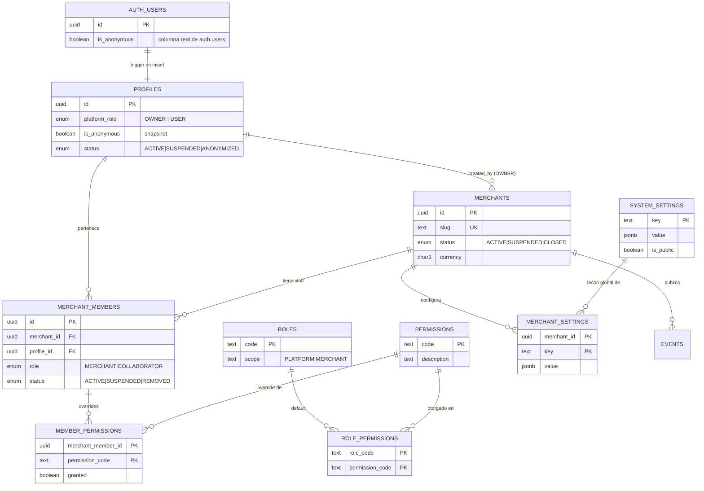
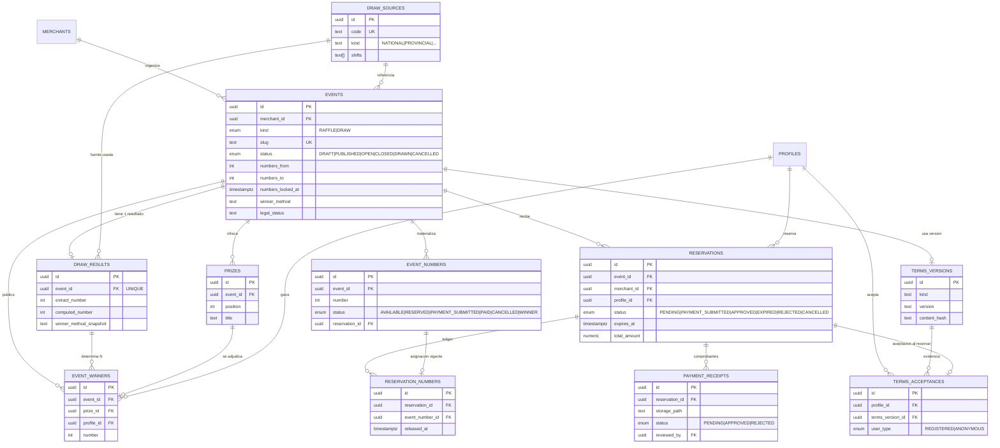

# Arquitectura — Plataforma SaaS multicomercio de sorteos y rifas

**Fase 1 — Documento de arquitectura.** Todavía **no** se escribió código de aplicación.
Este documento responde los 15 puntos pedidos. Antes de implementar necesito confirmación sobre §21 (decisiones abiertas) y resolver §22 (blockers técnicos).

Regla rectora aplicada en cada decisión: **estúpidamente sencilla de usar, no estúpidamente diseñada.**

---

## 0. Hallazgos verificados del repositorio y del entorno

El repositorio `leoroan/rifas-y-sorteos` estaba **vacío** (un único commit inicial con un README de 2 líneas). No hay código previo, ni convenciones que preservar, ni nada que romper. Rama de trabajo: `cline/taf6j0my`.

Probes de sólo lectura contra el proyecto Supabase `fwouperxtggwfageypss`:

| Verificación | Resultado | Consecuencia |
|---|---|---|
| ¿Proyecto vivo? | Sí. `/auth/v1/settings` responde 200 con la publishable key | Credenciales válidas |
| `sb_publishable_...` como `apikey` | Aceptada en `/auth/v1/*` y `/rest/v1/*`. Clave inválida → `401 Invalid API key` | Sirve para supabase-js v2 tal cual |
| Tablas existentes | Ninguna (`PGRST205` en `profiles`) | Proyecto limpio, migraciones desde cero |
| Buckets existentes | `[]` (vacío) | Hay que crear `receipts` (privado) y `public-assets` |
| **Anonymous sign-ins** | **`anonymous_users: false` — DESHABILITADO** | **Blocker para el flujo anónimo.** Sólo el dueño de la cuenta puede habilitarlo en el dashboard |
| Email/password | Habilitado, **`mailer_autoconfirm: false`** | El registro exige confirmar email por link. Afecta la conversión anónimo→registrado (§9) |
| Otras providers (Google, phone, etc.) | Todas deshabilitadas | MVP sólo email + anónimo |
| Versión GoTrue / Storage | `2.197.0` / `1.77.5`, Postgres 15/17 | `pg_cron` disponible; `ALTER TYPE ADD VALUE` no usable en la misma transacción |
| Acceso a DB (psql / service_role / CLI Supabase) | **No disponible en este entorno** | No puedo aplicar migraciones. Ver §22 |

---

## 1. Principios que gobiernan el diseño

1. **El canal de mensajería no es parte del sistema.** WhatsApp/Telegram/Instagram son *canales externos*. El MVP genera texto y links para copiar/compartir. Cero integración oficial.
2. **La base de datos es la frontera de seguridad.** React sólo decide qué *mostrar*. Toda regla de negocio crítica vive en PostgreSQL: RLS, `CHECK`, índices únicos y funciones RPC transaccionales.
3. **Una operación de negocio = una llamada atómica.** Nada de "SELECT → decidir en JS → INSERT" para reservas, aprobaciones, estados o roles.
4. **Menos tablas cuando es posible, sin perder integridad.** Cuando dos entidades son realmente una, se fusionan. Cuando falta historia, se agrega *ledger*.
5. **Estados explícitos y transiciones cerradas.** Cada máquina de estado se documenta y se hace cumplir en la DB, no en la UI.
6. **Extensible por *seams* explícitos**, no por abstracción prematura: `draw_source`, `notifications`, `abuse_control`, `NotificationService`.
7. **Nada de secretos en el navegador.** Sólo la publishable key. `service_role` jamás en Vite/GitHub Pages.

## 2. Riesgos y contradicciones detectados (leer antes de aprobar)

Los señalo ahora porque el pedido exige detenerse ante problemas de seguridad, integridad o escalabilidad.

### R1 — Los anonymous sign-ins están deshabilitados y son un requisito del MVP · **BLOCKER**
El modelo pedido (participar sin cuenta) depende de Supabase Anonymous Sign-Ins, hoy apagado. Riesgos asociados, todos ciertos:

- Un usuario anónimo **es una fila real en `auth.users`**. Sin límites es un vector de crecimiento y abuso de base de datos. El rate limit por IP por defecto (30/hora) es mitigación parcial, no suficiente.
- **No hay limpieza automática** de usuarios anónimos en Supabase. Hay que diseñar retención/purga (§10).
- Los anónimos obtienen rol Postgres `authenticated`, **no** `anon`. Si confiáramos en `auth.role()`, las policies los tratarían como usuarios plenos. Toda policy que deba restringirlos tiene que chequear el claim `is_anonymous`.
- **CAPTCHA/Turnstile requiere verificación server-side** (el secret no puede ir en el bundle). Con hosting 100% estático (GitHub Pages) *no se puede* verificar Turnstile sin una Edge Function: es una contradicción real entre "sólo GitHub Pages" y "antiabuso con CAPTCHA". Propuesta en §10.

### R2 — Emails sin autoconfirmar complican la conversión anónimo→registrado
Con `mailer_autoconfirm: false` el registro exige abrir el link del correo. La conversión documentada de Supabase es **en dos pasos**: (1) `updateUser({ email })` vincula la identidad y **conserva el mismo UUID**; (2) verificar el email; (3) recién entonces `updateUser({ password })`. Entre la participación y la cuenta definitiva hay un **estado intermedio "anónimo con email pendiente"**. No es bloqueante, pero hay que diseñarlo explícitamente (§9) o activar autoconfirmar. Además el *linking manual* debe estar habilitado en el proyecto.

### R3 — "Definir el ganador por lotería" necesita una fórmula acordada, no una intuición
"Usar la Lotería Nacional como referencia" no determina por sí solo un ganador: falta la **regla de conversión** extracto→número. Si queda implícita, dos comercios calcularán distinto y el resultado será impugnable. Propongo `winner_method` explícito por evento y los **inputs de la fórmula guardados como snapshot** para auditoría (§11). Semántica a confirmar (§21 D5).

### R4 — La IP es dato personal y el antiabuso la necesita
Contradicción real. Resolución propuesta: **nunca guardar IP cruda**; sólo `hmac(ip, salt)` con salt rotativo y TTL de retención, y nunca en `audit_logs`. Detalle en §10 y §18.

### R5 — Evento cancelado con números ya pagados = problema de dinero, no de software
No hay reembolsos automáticos en el MVP (pagos externos). El sistema debe **registrar y comunicar**, no resolver. Obliga a política de cancelación visible y aceptada, y a que `CANCELLED` no borre evidencia (§18).

### R6 — El Owner puede leer PII de participantes de todos los comercios
"Visualizar información global necesaria" choca con minimización de datos y con la política de privacidad. Propongo: el Owner ve **datos agregados/operativos** por defecto, y el acceso a PII cruda queda **auditado** y acotado. A confirmar (§21 D7).

### R7 — Expiración de reservas requiere un reloj del lado del servidor
GitHub Pages no tiene cron. La expiración puede resolverse de forma *lazy* (al leer o al reservar) y además con `pg_cron`. Si sólo se hace lazy, un número vencido puede verse ocupado hasta que alguien interactúe. Propongo **ambas**: `pg_cron` cada minuto + verificación defensiva en cada RPC (§7).

### R8 — El claim `is_anonymous` del JWT queda obsoleto tras la conversión
El JWT vive ~1 hora. Si una policy dependiera de `is_anonymous` para *seguridad*, un usuario recién convertido seguiría tratado como anónimo hasta el refresh. Mitigación: `is_anonymous` se usa sólo para **límites más estrictos** (no para seguridad) y las decisiones sensibles consultan la **fila real** en `profiles`/`auth.users` vía función, nunca el claim.

### R9 — Enums de Postgres y evolución
`ALTER TYPE ... ADD VALUE` no puede usarse en la misma transacción que lo agrega. Para los conjuntos que el propio pedido declara *jurisdiccionalmente flexibles* (`legal_status`, `draw_source.kind`, `draw_shift`, `winner_method`) uso **`text` + `CHECK`**, que evoluciona sin fricción. Reservo enums para las máquinas de estado estables.

### R10 — Derecho de supresión vs. integridad de auditoría
Un ganador o un comprobante rechazado no se puede borrar sin destruir evidencia. Propongo **anonimización en lugar de borrado**: se conservan IDs y hechos, se eliminan PII y el archivo de Storage. A confirmar (§21 D8).

### R11 — Ambigüedad del pedido: los números como entidad materializada
"Definir cantidad total de números" (p.ej. 1..5000) puede modelarse como rango o como filas. Elegí **filas materializadas** (`event_numbers`) al publicar, porque son la única forma de tener *constraint único*, CAS atómico e índices eficientes. Costo: hasta 5.000 filas por evento, trivial para PostgreSQL. Ver §3.

### R12 — `PUBLISHED` vs `OPEN` (estado descriptivo vs. autoridad temporal)
Tener ambos invita a la clase de bug "el estado dice OPEN pero ya venció". Resuelvo: el estado **describe**, pero **la autoridad es el tiempo** (`starts_at <= now() <= participation_ends_at`, evaluado en PostgreSQL). El RPC rechaza reservas fuera de ventana *aunque* el estado diga `OPEN` (§6).

## 3. Modelo de datos

23 tablas. Nombres en `snake_case`, códigos en inglés, etiquetas en español en la UI (constantes de frontend), para que el backend no dependa del idioma.

Convenciones aplicadas a **todas** las tablas:

- PK `id uuid default gen_random_uuid()`.
- `created_at timestamptz not null default now()`, `updated_at timestamptz` mantenido por trigger `set_updated_at()`.
- **Sin `ON DELETE CASCADE` en nada que represente dinero, participación o auditoría.** `RESTRICT` por defecto. Se usa `CASCADE` sólo en hijos puramente estructurales (`event_numbers` de un evento `DRAFT`).
- Fechas siempre `timestamptz` (UTC en almacenamiento). La zona horaria del evento se guarda aparte, sólo para mostrar.
- Dinero: `numeric(12,2)`. El pedido excluye multicurrency ⇒ `currency char(3)` por comercio, con **snapshot** en el evento y en la reserva.
- Nada de listas JSON como reemplazo de relaciones. `jsonb` se usa sólo en 4 lugares justificados: `audit_logs.before/after`, `notifications.data`, `*_settings.value` y `draw_results.raw_payload`.

### 3.1 Identidad y tenancy

**`profiles`** — espejo 1:1 de `auth.users` (`id` = `auth.users.id`, FK). Se crea por trigger `on auth.users insert`.

| columna | tipo | notas |
|---|---|---|
| `id` | uuid PK | FK → `auth.users(id)` on delete restrict |
| `display_name` | text | obligatorio para staff, opcional para participante |
| `email` | text | **cache** del email de `auth.users` (para listados de staff sin tocar el schema `auth`) |
| `is_anonymous` | boolean not null default true | snapshot; lo mantiene el flujo de conversión |
| `converted_at` | timestamptz | cuándo pasó de anónimo a permanente |
| `platform_role` | enum `platform_role` | `OWNER` \| `USER`, default `USER` |
| `status` | enum `profile_status` | `ACTIVE` \| `SUSPENDED` \| `ANONYMIZED` |
| `last_seen_at` | timestamptz | para retención/purga de anónimos |

`platform_role` **no** puede ser modificado por el propio usuario: no hay policy de `UPDATE` que lo permita y un trigger `prevent_privilege_escalation` rechaza cualquier cambio si `current_user` no es `postgres`/`service_role`. El OWNER inicial se siembra en migración con un UUID declarado (§22 B3).

**`merchants`** — el comercio (tenant).

| columna | tipo | notas |
|---|---|---|
| `id` | uuid PK | |
| `name`, `slug` | text | `slug` único, `^[a-z0-9-]{3,40}$` |
| `description`, `logo_path` | text | `logo_path` apunta a `public-assets` |
| `contact_phone`, `contact_whatsapp`, `contact_instagram` | text | **texto plano**, no integración (§17.6) |
| `timezone` | text not null default `'America/Argentina/Buenos_Aires'` | validado contra `pg_timezone_names` |
| `currency` | char(3) not null default `'ARS'` | |
| `status` | enum `merchant_status` | `ACTIVE` \| `SUSPENDED` \| `CLOSED` |
| `legal_name`, `tax_id` | text | datos del responsable, para T&C |
| `created_by` | uuid | FK profiles, quién lo dio de alta (OWNER) |

**`merchant_members`** — une `profiles` con `merchants` en rol `MERCHANT` o `COLLABORATOR`.

| columna | tipo | notas |
|---|---|---|
| `id` | uuid PK | |
| `merchant_id`, `profile_id` | uuid | UNIQUE `(merchant_id, profile_id)` |
| `role` | enum `member_role` | `MERCHANT` \| `COLLABORATOR` |
| `status` | enum `member_status` | `ACTIVE` \| `SUSPENDED` \| `REMOVED` |
| `invited_by`, `joined_at`, `removed_at` | | |

Regla de negocio central: **un `profile` puede tener como máximo un `merchant_members` con `role=MERCHANT` por comercio**, y el alta de `MERCHANT` sólo la puede hacer el OWNER (RPC `admin_assign_merchant`, §5). Un `MERCHANT` sí puede dar de alta `COLLABORATOR` dentro de su propio comercio.

**`roles` / `permissions` / `role_permissions`** — catálogo RBAC (datos semilla, no configurables por clientes).

- `roles(code PK, label, scope)`: `OWNER` (scope `PLATFORM`), `MERCHANT` y `COLLABORATOR` (scope `MERCHANT`), `PARTICIPANT` (scope `PLATFORM`, sin privilegios elevados).
- `permissions(code PK, description, scope)`: 18 códigos (§5.2).
- `role_permissions(role_code, permission_code)`: matriz por defecto, PK compuesta.

Existen para poder decir `has_merchant_permission(m, 'event.publish')` sin hardcodear roles dentro de cada policy, y para que agregar un rol futuro (p.ej. `AUDITOR`) no obligue a reescribir 40 policies.

**`member_permissions`** — *overrides* por colaborador (permitir excepcionalmente un permiso extra, o revocarlo).

| columna | tipo | notas |
|---|---|---|
| `merchant_member_id`, `permission_code` | | PK compuesta |
| `granted` | boolean | `true` agrega, `false` **quita** |
| `granted_by`, `created_at` | | |

Es la tabla que satisface "asignar permisos dentro de los límites definidos por el sistema": un override **sólo puede quitar** permisos, o agregar permisos que `role_permissions` ya le otorga al rol `MERCHANT` (o sea: nunca por encima del techo del comerciante). Esta regla se impone en el RPC `staff_set_permission` **y** con una validación en la función de resolución. MVP puede dejarla vacía: si no hay filas, rige el default del rol.

### 3.2 Eventos y números

**`events`** — la entidad central. Un solo modelo para `RAFFLE` y `DRAW` (el pedido pide no separarlos rígidamente): `kind` distingue, la estructura es la misma.

| grupo | columnas |
|---|---|
| identidad | `id`, `merchant_id` FK, `kind` enum `event_kind` (`RAFFLE`\|`DRAW`), `title`, `slug` UNIQUE, `description`, `cover_path` |
| estado | `status` enum `event_status`, `published_at`, `closed_at`, `drawn_at`, `cancelled_at`, `cancellation_reason` |
| ventana temporal | `starts_at`, `participation_ends_at`, `expected_draw_at`, `timezone` |
| números (inmutables tras publicar) | `numbers_from` int, `numbers_to` int, `number_padding` smallint, `numbers_locked_at` timestamptz |
| dinero (snapshot) | `price_per_number` numeric(12,2), `currency` char(3) |
| límites por participante | `max_numbers_registered`, `max_numbers_anonymous`, `reservation_ttl_registered` interval, `reservation_ttl_anonymous` interval |
| ganador | `winner_method` text CHECK (§11), `draw_source_id` FK, `draw_shift` text, `draw_source_detail` text |
| legal | `legal_status` text CHECK, `legal_notes` text, `terms_version_id` FK |
| auditoría | `created_by`, `updated_by`, `created_at`, `updated_at` |

Constraints clave:

- `CHECK (numbers_to >= numbers_from)` y `CHECK (numbers_to - numbers_from + 1 BETWEEN 1 AND 5000)`.
- `CHECK (participation_ends_at > starts_at)` y `CHECK (expected_draw_at >= participation_ends_at)`.
- `CHECK (price_per_number >= 0)`, `CHECK (max_numbers_* BETWEEN 1 AND 1000)`, `CHECK (number_padding BETWEEN 1 AND 6)`.
- **`numbers_locked_at` + trigger `events_guard_numbers_immutability`**: si `numbers_locked_at is not null`, cualquier intento de cambiar `numbers_from`, `numbers_to`, `number_padding` o `kind` lanza excepción. Se setea al publicar (y también si llegara a existir una sola reserva). Satisface "nadie puede modificar el número total después de iniciado el evento" **en la base**, aunque alguien llame la API directamente.
- Trigger `events_guard_terms_immutability`: `terms_version_id` y los textos legales no cambian una vez que el evento salió de `DRAFT`.
- Trigger `events_guard_status_transitions`: valida la matriz de §6. Ninguna transición arbitraria.

**`event_numbers`** — una fila por número. Es el **estado actual** y el punto de serialización de la concurrencia.

| columna | tipo | notas |
|---|---|---|
| `id` | uuid PK | |
| `event_id` | uuid FK | |
| `number` | int | número real (1..5000) |
| `display_code` | text | `lpad(number, padding, '0')` para mostrar/ordenar |
| `status` | enum `number_status` | `AVAILABLE` \| `RESERVED` \| `PAYMENT_SUBMITTED` \| `PAID` \| `CANCELLED` \| `WINNER` |
| `reservation_id` | uuid FK null | tenedor actual; NULL ⟺ `status='AVAILABLE'` |
| `updated_at` | timestamptz | |

- `UNIQUE (event_id, number)` — imposible duplicar un número.
- **`UNIQUE (event_id, reservation_id)` parcial donde `reservation_id is not null`** — imposible que un número pertenezca a dos reservas a la vez. Segunda red de seguridad, independiente del CAS.
- `CHECK ((status = 'AVAILABLE') = (reservation_id is null))` — invariante explícita, no confiada al código.
- Índice `(event_id, status)` para el grid público y los conteos.
- Se materializan en la transición `DRAFT → PUBLISHED`, con `insert ... select generate_series(numbers_from, numbers_to)`.

### 3.3 Reservas y comprobantes

**`reservations`** — un *hold* sobre 1..N números, propiedad de un participante.

| columna | tipo | notas |
|---|---|---|
| `id` | uuid PK | |
| `event_id` | uuid FK | |
| `merchant_id` | uuid FK | **desnormalizado a propósito** para RLS simple y barata (§8) |
| `profile_id` | uuid FK | dueño; anónimo o registrado |
| `status` | enum `reservation_status` | §6 |
| `number_count` | int | |
| `unit_price`, `total_amount`, `currency` | numeric / char(3) | **snapshot**: si el comercio cambia el precio, la reserva vieja no se altera |
| `reserved_at`, `expires_at` | timestamptz | `expires_at` lo calcula la DB desde el TTL vigente, nunca el cliente |
| `payment_submitted_at`, `review_deadline_at`, `approved_at`, `closed_at` | timestamptz | |
| `expiration_reason`, `review_note`, `cancel_reason` | text | |
| `rejection_count` | int default 0 | alimenta el antiabuso (§10) |
| `terms_acceptance_id` | uuid FK | evidencia de aceptación (§18) |

Índices: `(profile_id, status)`, `(event_id, status)`, `(status, expires_at)` para el job de expiración, `(merchant_id, status)` para el panel.

**`reservation_numbers`** — *ledger* histórico (append-only) de qué número estuvo en qué reserva.

| columna | tipo | notas |
|---|---|---|
| `id`, `reservation_id`, `event_number_id` | uuid | |
| `event_id`, `number` | | desnormalizado para consultas históricas sin joins |
| `assigned_at`, `released_at` | timestamptz | `released_at` null = asignación vigente |
| `release_reason` | text | `EXPIRED` \| `REJECTED` \| `CANCELLED` \| `PAID` |

**Invariante explícita, documentada y testeada:** `event_numbers` = estado presente (rápido, CAS, único). `reservation_numbers` = historia (auditoría, "quién tuvo el 25 y cuándo"). Ambas se escriben **dentro de la misma transacción** en los RPC, nunca por separado desde el cliente. Un test verifica que no exista `event_numbers.reservation_id` sin asignación vigente en el ledger.

**`payment_receipts`** — el archivo NO se guarda acá, sólo su metadata (§13).

| columna | tipo | notas |
|---|---|---|
| `id` | uuid PK | |
| `reservation_id` | uuid FK | |
| `merchant_id`, `event_id` | uuid FK | desnormalizados para RLS |
| `uploaded_by` | uuid FK profiles | |
| `storage_path` | text not null | ruta en el bucket privado `receipts` |
| `original_name`, `mime_type`, `size_bytes` | | metadata para validar/depurar |
| `checksum_sha256` | text null | opcional, anti-duplicado |
| `status` | enum `receipt_status` | `PENDING` \| `APPROVED` \| `REJECTED` |
| `reviewed_by`, `reviewed_at`, `review_reason` | | |
| `created_at` | timestamptz | |

- Índice parcial `UNIQUE (reservation_id) WHERE status='PENDING'` — **un solo comprobante en revisión por reserva** (evita spam).
- `CHECK (mime_type IN ('image/jpeg','image/png','image/webp','application/pdf'))` y `CHECK (size_bytes BETWEEN 1 AND 8388608)` — el bucket es la primera barrera, esto la segunda.
- `CHECK (reviewed_by IS DISTINCT FROM uploaded_by)`: nadie se autorrevisa. La prohibición dura (staff del comercio igualmente no puede) se aplica en el RPC `review_receipt` (§14.1).

### 3.4 Premios, sorteo y ganadores

**`prizes`** — entidad propia, N por evento.

`id`, `event_id` FK, `position` int, `title`, `description`, `image_path`, `estimated_value numeric(12,2)`, `currency`, `conditions` text, `status` text CHECK (`ACTIVE`\|`DELIVERED`\|`CANCELLED`), `created_by`, timestamps. UNIQUE `(event_id, position)`.

**`draw_sources`** — catálogo flexible, **no hardcodeado**.

`id`, `code` UNIQUE, `name`, `kind` text CHECK (`NATIONAL`\|`PROVINCIAL`\|`MUNICIPAL`\|`PRIVATE`\|`OTHER`), `jurisdiction` text, `shifts` text[] (p.ej. `{MATUTINA,VESPERTINA,NOCTURNA,UNICA}`), `timezone`, `is_active`, `sort_order`.

Es tabla y no enum porque el pedido advierte que las opciones no son universalmente válidas: el OWNER agrega loterías desde configuración, sin migración de esquema. Se siembran pocas y marcables como activas/inactivas.

**`draw_results`** — el hecho bruto del sorteo, 1 por evento (UNIQUE `event_id`). Guarda **todo lo necesario para reproducir la fórmula**:

`id`, `event_id`, `draw_source_id`, `draw_source_snapshot` text (nombre al momento), `draw_shift`, `draw_date` date, `raw_payload` jsonb (extracto completo tal como se publicó), `extract_number` int, `winner_method_snapshot` text, `numbers_from_snapshot` int, `numbers_to_snapshot` int, `computed_number` int, `evidence_url` text, `evidence_path` text, `recorded_by`, `recorded_at`, `notes`.

Los `*_snapshot` son deliberados: si mañana se corrige el rango del evento (en `DRAFT`) o la fórmula, el resultado histórico sigue siendo explicable. Sin ellos, un ganador pasado sería indefendible.

**`event_winners`** — resultado publicado, 1..N por evento (uno por premio).

`id`, `event_id`, `prize_id` FK, `draw_result_id` FK, `profile_id` FK, `reservation_id` FK, `event_number_id` FK, `number` int, `position` int, `published_at`, `notified_at`, `claim_deadline_at`, `claim_status` text CHECK (`PENDING`\|`CLAIMED`\|`EXPIRED`\|`DELIVERED`), `notes`.

Se separa de `draw_results` porque **un sorteo determina varios ganadores** (uno por premio). Un solo `draw_result` (extracto) + N `event_winners`. UNIQUE `(event_id, prize_id)`.

### 3.5 Notificaciones, legal, auditoría, seguridad y configuración

**`notifications`** — bandeja interna **y** outbox. Una sola tabla, sin cola extra.

`id`, `recipient_profile_id` FK, `merchant_id` FK null, `event_id` FK null, `reservation_id` FK null, `type` text (código de §16, sin enum para poder crecer), `channel` enum `notification_channel` (`INTERNAL`, y a futuro `EMAIL`\|`WHATSAPP`\|`TELEGRAM`\|`PUSH`), `title`, `body`, `data` jsonb, `status` enum `notification_status` (`PENDING`\|`SENT`\|`READ`\|`FAILED`\|`SKIPPED`), `attempts` int, `last_error` text, `created_at`, `sent_at`, `read_at`.

`jsonb` acá sí es correcto: es *payload de transporte*, no datos relacionales consultables. Índices `(recipient_profile_id, read_at)`, `(status, channel)`.

**`terms_versions`** — textos versionados, nunca sobrescritos.

`id`, `scope` enum `terms_scope` (`GLOBAL`\|`EVENT`), `event_id` FK null, `kind` enum `terms_kind` (`TERMS`\|`PRIVACY`\|`PARTICIPATION_RULES`\|`EVENT_TERMS`), `version` text, `content` text (markdown), `content_hash` text, `published_at`, `is_current` boolean, `created_by`.

- UNIQUE `(scope, event_id, kind, version)`.
- Índice parcial UNIQUE para una sola versión `is_current` por `(scope, event_id, kind)`.
- `CHECK ((scope='EVENT') = (event_id IS NOT NULL))`.

**`terms_acceptances`** — evidencia de aceptación, inmutable.

`id`, `profile_id` FK, `terms_version_id` FK, `event_id` FK null, `reservation_id` FK null, `user_type` enum (`REGISTERED`\|`ANONYMOUS`), `accepted_at`, `content_hash_snapshot`, `source` text (`WEB`\|`API`), `ip_hash` text null, `user_agent_hash` text null.

UNIQUE `(profile_id, terms_version_id)`. Sin policies de `UPDATE`/`DELETE` (append-only): la evidencia no se reescribe.

**`audit_logs`** — append-only, con `REVOKE UPDATE, DELETE`.

`id`, `actor_profile_id` FK null, `actor_platform_role`, `actor_merchant_role`, `merchant_id` FK null, `event_id` FK null, `entity_type` text, `entity_id` uuid null, `action` text (código, §15), `before` jsonb, `after` jsonb, `metadata` jsonb, `created_at`.

Sin FKs `CASCADE`; `actor_profile_id` con `ON DELETE SET NULL` para permitir anonimizar sin perder el hecho. Se audita lo que toca **dinero, participación, permisos o resultado**, no todo (§15).

**`security_blocks`** — bloqueos y el *seam* `abuse_control`.

`id`, `scope` text CHECK (`GLOBAL`\|`MERCHANT`\|`EVENT`), `merchant_id` FK null, `event_id` FK null, `subject_profile_id` FK null, `subject_key` text null (hash de IP u otra señal), `reason` text, `source` text (`AUTO_ABUSE`\|`MANUAL`\|`RATE_LIMIT`), `blocked_by` FK null, `starts_at`, `blocked_until` timestamptz null (null = indefinido), `lifted_at` null, `lift_reason` text.

Índices `(subject_profile_id, blocked_until)`, `(subject_key, blocked_until)`. `CHECK (subject_profile_id IS NOT NULL OR subject_key IS NOT NULL)`.

**`system_settings`** — configuración global (OWNER). Clave/valor, no 60 columnas.

`key` text PK, `value` jsonb not null, `value_type` text CHECK (`int`\|`numeric`\|`bool`\|`text`\|`interval`\|`json`), `description` text, `is_public` boolean default false (si puede leerla un cliente no autenticado), `min_value`/`max_value` numeric null (autodocumenta y valida rangos), `updated_by`, `updated_at`.

**`merchant_settings`** — overrides del comercio.

`merchant_id` FK, `key` text, `value` jsonb, `updated_by`, `updated_at`, PK `(merchant_id, key)`. FK lógica a `system_settings.key` (FK real, con `ON DELETE RESTRICT`).

**Regla dura de configuración (§12):** el comerciante **nunca** puede aflojar una regla global de seguridad. Se impone con una función `private.fn_effective_setting(merchant_id, key)` que aplica el techo global, usada por el RPC `set_merchant_setting` (que **rechaza** el valor inválido, no lo clampa en silencio) y por un trigger de validación. Nada de "el frontend limita el input".

### 3.6 Tablas que decidí NO crear (y por qué)

Aplicando "menos tablas" del principio 52:

| Descartada | Motivo |
|---|---|
| `abuse_events` / `abuse_signals` | Todo lo que necesita el antiabuso MVP es **derivable** con índices de `reservations` (`status`, `reservation_ttl`, `rejection_count`, `reserved_at`) + `security_blocks`. Una tabla nueva sería un cache prematuro. Cuando aparezcan CAPTCHA/fingerprint/reputación, `security_blocks.subject_key` + una tabla `abuse_signals` son el lugar natural: el seam ya existe. |
| `participants` | Un participante **es** un `profiles` + sus `reservations`. Una tabla `participants` sólo duplicaría. |
| `merchant_users` separada de `merchant_members` | Ya es la tabla de membresía. |
| `event_prizes_history` | Volver a `DRAFT` no es posible desde `PUBLISHED`; el `audit_logs` cubre los cambios de premios en `DRAFT`. |
| `reservation_status_history` | `reservation_numbers` (ledger) + `audit_logs` cubren transiciones relevantes. Un historial de estado por fila es sobreingeniería para el MVP. |
| `file_uploads` genérica | Sólo hay un tipo de archivo sensible (comprobantes) y uno público (imágenes). |
| `notifications_queue` | `notifications.status='PENDING'` ya es la cola. |

## 4. Diagrama de relaciones

Dos diagramas para que sean legibles: tenancy/identidad y participación/sorteo.

### 4.1 Tenancy, identidad y RBAC



### 4.2 Evento, participación, pago y resultado



## 5. Roles y permisos

### 5.1 Los cuatro roles

| Rol | Almacenado en | Alcance | Puede |
|---|---|---|---|
| `OWNER` | `profiles.platform_role='OWNER'` | Toda la plataforma | Crear/suspender comercios, **asignar y quitar `MERCHANT`**, catálogo de `draw_sources`, `system_settings`, ver auditoría global, gestionar `legal_status` |
| `MERCHANT` | `merchant_members.role='MERCHANT'` (1 por comercio) | **Sólo su comercio** | Configurar comercio, staff, eventos, premios, revisar reservas/comprobantes, cerrar, registrar resultado |
| `COLLABORATOR` | `merchant_members.role='COLLABORATOR'` | **Sólo su comercio**, según permisos | Lo que el rol otorgue y el comerciante no haya revocado |
| `PARTICIPANT` | *implícito* (cualquier `profiles` sin membresía) | Eventos de comercios donde **no** tiene relación | Ver eventos públicos, reservar, subir comprobante, ver sus resultados |

`OWNER` no existe como fila en `merchant_members`: es ortogonal. Un OWNER *puede además* ser MERCHANT de un comercio (caso real: el dueño del producto tiene su propio comercio de prueba), y eso no le da permiso para participar en él (§7.3).

**Prohibición explícita y verificada:** ninguna combinación de `MERCHANT` o `COLLABORATOR` puede otorgar `MERCHANT` a nadie. La RPC `admin_assign_merchant` es la única vía y exige `is_owner()`. Se testea (§20 caso 5 y 6).

### 5.2 Catálogo de permisos

Se implementan los permisos pedidos, **sin inflar**. 18 códigos, agrupados:

| Grupo | Códigos |
|---|---|
| Evento | `event.view`, `event.create`, `event.update`, `event.publish`, `event.close`, `event.cancel`, `event.draw` |
| Premios | `prize.manage` |
| Reservas | `reservation.create`, `reservation.view`, `reservation.confirm`, `reservation.cancel` |
| Pagos | `payment.receipt.upload`, `payment.receipt.review` |
| Staff | `staff.manage`, `staff.suspend` |
| Estadísticas | `stats.view` |
| Plataforma | `merchant.manage` (exclusivo OWNER) |

`reservation.create` y `payment.receipt.upload` pertenecen al rol `PARTICIPANT` y se evalúan contra el **evento**, no contra el comercio: son las dos únicas operaciones donde un no-miembro opera dentro de un tenant, y por eso tienen validaciones extra (§7.3, §8).

### 5.3 Matriz por defecto `role_permissions`

| Permiso | OWNER | MERCHANT | COLLABORATOR | PARTICIPANT |
|---|:--:|:--:|:--:|:--:|
| `event.view` | ✔ global | ✔ | ✔ | ✔ (sólo públicos) |
| `event.create` / `update` / `publish` | ✔ | ✔ | ✖ | ✖ |
| `event.close` | ✔ | ✔ | ✔* | ✖ |
| `event.cancel` / `event.draw` | ✔ | ✔ | ✖ | ✖ |
| `prize.manage` | ✔ | ✔ | ✔* | ✖ |
| `reservation.view` | ✔ global | ✔ | ✔ | ✔ (sólo propias) |
| `reservation.create` | ✖ (si participa) | ✖ | ✖ | ✔ |
| `reservation.confirm` / `cancel` | ✔ | ✔ | ✔* | ✔ (sólo cancelar propias, en `PENDING`) |
| `payment.receipt.upload` | ✖ | ✖ | ✖ | ✔ (sólo propias) |
| `payment.receipt.review` | ✔ global | ✔ | ✔* | ✖ |
| `staff.manage` / `staff.suspend` | ✔ | ✔ | ✖ | ✖ |
| `stats.view` | ✔ global | ✔ | ✔* | ✖ |
| `merchant.manage` | ✔ | ✖ | ✖ | ✖ |

`✔*` = el `MERCHANT` decide si se lo otorga a un colaborador específico, **dentro del techo de `MERCHANT`**: un colaborador nunca puede recibir un permiso que `MERCHANT` no tenga (p.ej. `event.cancel` no es delegable en el MVP; `merchant.manage` jamás). `member_permissions.granted=false` puede quitar cualquiera.

`OWNER` **no** obtiene automáticamente `reservation.create` en eventos de terceros: el Owner que quiere participar lo hace como un `PARTICIPANT` normal.

### 5.4 Resolución efectiva (una sola función, un solo lugar)

```
private.fn_effective_permissions(profile_id, merchant_id) -> setof text
```

Algoritmo: si `is_owner(profile_id)` → todos los permisos de scope `PLATFORM`; si hay `merchant_members` con `status='ACTIVE'` → permisos de `role_permissions[role]` aplicando `member_permissions` (los `false` restan, los `true` suman **sólo si el rol MERCHANT también los tiene**). Si está `SUSPENDED` o `REMOVED` → conjunto vacío.

`private.has_merchant_permission(merchant_id, permission)` lo consume. **Ninguna policy duplica esta lógica**: todas llaman a esta función (principio de §8 y pedido de "no duplicar lógica gigantesca").

## 6. Estados y máquinas de estado

### 6.1 Evento (`event_status`)

```text
DRAFT ──publish──► PUBLISHED ──(starts_at alcanzado)──► OPEN ──close / participation_ends_at──► CLOSED ──draw──► DRAWN

DRAFT ─┐
PUBLISHED ─┤
OPEN ─┼──► CANCELLED
CLOSED ─┘

DRAWN ──► (terminal)
CANCELLED ──► (terminal)
```

Matriz permitida (validada en trigger `events_guard_status_transitions`):

| desde | hacia permitidos |
|---|---|
| `DRAFT` | `PUBLISHED`, `CANCELLED` |
| `PUBLISHED` | `OPEN`, `CLOSED`, `CANCELLED` |
| `OPEN` | `CLOSED`, `CANCELLED` |
| `CLOSED` | `DRAWN`, `CANCELLED` |
| `DRAWN` | — |
| `CANCELLED` | — |

Efectos obligatorios (misma transacción, dentro del RPC):

- `DRAFT → PUBLISHED`: materializa `event_numbers`; congela `numbers_locked_at`; valida que exista al menos 1 premio, `draw_source_id`, y términos aceptables. Falla entera si algo no está.
- `→ OPEN`: no toca datos. Se aplica si `now() >= starts_at` (lo hace un RPC `event_sync_status` o `pg_cron`).
- `→ CLOSED`: no se aceptan más reservas. **No** libera reservas `PENDING` que aún no vencieron: se les da su TTL restante para subir comprobante.
- `→ DRAWN`: exige que existan `draw_results`. Exige que no queden `PENDING`/`PAYMENT_SUBMITTED`… decisión D6 (§21).
- `→ CANCELLED`: libera números en `AVAILABLE`/`RESERVED` a `CANCELLED`; **no** toca los `PAID` (hay dinero de por medio): los deja y los marca para gestión humana, y emite notificación. Motivo obligatorio.

**`PUBLISHED` describe, el tiempo manda (R12).** El RPC de reserva siempre evalúa `now() BETWEEN starts_at AND participation_ends_at` contra la hora de PostgreSQL. Un evento `OPEN` con ventana vencida rechaza reservas; un evento `PUBLISHED` con `starts_at` ya alcanzado las acepta aunque el cron todavía no lo haya movido de estado.

### 6.2 Número (`number_status`)

```text
AVAILABLE ──reserve──► RESERVED ──upload receipt──► PAYMENT_SUBMITTED ──approve──► PAID ──draw──► WINNER
    ▲                     │                              │
    │                     │ expire / cancel              │ reject_correction
    │                     ▼                              ▼
    │                   AVAILABLE  ◄────────────────  AVAILABLE
    │                     ▲
    └───── expire / reject ┘
                          │
                   CANCELLED (evento cancelado o número anulado por staff)
```

Reglas no negociables, con constraint y test cada una:

1. `PAID` **nunca** vuelve a `AVAILABLE`. No existe transición. Para revertir un pago aprobado por error, la vía es una operación explícita de staff (`reservation.reopen`) que deja rastro en `audit_logs` y sólo es válida si el evento no está `DRAWN`.
2. `reservation_id IS NULL ⟺ status='AVAILABLE'` (CHECK).
3. Todo estado ≠ `AVAILABLE` tiene `reservation_id` no nulo y una reserva vigente.
4. `WINNER` sólo se asigna desde `PAID`.
5. `CANCELLED` (a nivel número) sólo desde `AVAILABLE`, `RESERVED` o `PAYMENT_SUBMITTED`.

### 6.3 Reserva (`reservation_status`)

```text
PENDING ──upload receipt──► PAYMENT_SUBMITTED ──approve──► APPROVED  (terminal, números → PAID)
   │                              │
   │ expire                       ├── request_correction ──► PENDING (con review_note, nuevo expires_at)
   ▼                              │
EXPIRED (terminal)                └── reject ──► REJECTED (terminal, números → AVAILABLE)

PENDING ──cancel (participante o staff)──► CANCELLED (terminal, números → AVAILABLE)
```

| Estado | ¿Números retenidos? | ¿Expira? | Transiciones |
|---|---|---|---|
| `PENDING` | Sí (`RESERVED`) | Sí, `expires_at = reserved_at + TTL` | → `PAYMENT_SUBMITTED`, `EXPIRED`, `CANCELLED` |
| `PAYMENT_SUBMITTED` | Sí (`PAYMENT_SUBMITTED`) | Sí, `review_deadline_at` (TTL de revisión, distinto) | → `APPROVED`, `REJECTED`, `PENDING` (corrección) |
| `APPROVED` | Sí (`PAID`, definitivo) | No | terminal |
| `EXPIRED` | No | — | terminal |
| `REJECTED` | No | — | terminal |
| `CANCELLED` | No | — | terminal |

**Decisión de diseño importante (justificada):** `PAYMENT_SUBMITTED` **no** usa el TTL de reserva, usa un **TTL de revisión** distinto (p.ej. 72 h, configurable). Si no, el participante que hizo todo bien pierde los números porque el comerciante tardó en revisar. Es un caso real y sería un bug de negocio, no de código. Cuando vence el TTL de revisión, el sistema **no** castiga al participante: pasa la reserva a `PENDING` con `review_note='revisión vencida'` y avisa al comercio, en lugar de expulsarla.

`REJECTED` es "no" definitivo; `request_correction` es la vía amable (vuelve a `PENDING`). Separar ambas acciones evita forzar al staff a elegir entre castigar o aprobar.

### 6.4 Comprobante (`receipt_status`)

```text
PENDING ──approve──► APPROVED   (además dispara reserva → APPROVED y números → PAID)
PENDING ──reject──► REJECTED    (además dispara reserva → REJECTED y números → AVAILABLE)
PENDING ──request_correction──► (queda APPROVED? no) → se marca REJECTED con review_reason='corrección solicitada'
                                 y la reserva vuelve a PENDING
```

Para no agregar un cuarto estado al comprobante, `request_correction` cierra el comprobante como `REJECTED` **con `review_reason` tipado** (`CORRECTION_REQUESTED` vs `DEFINITIVE`) y deja la reserva en `PENDING`. Así la reserva conserva su estado simple y el comprobante conserva su historial inmutable. El índice parcial "un solo `PENDING` por reserva" sigue funcionando.

**Ningún participante puede aprobar su propio comprobante:** no existe policy de `UPDATE` sobre `payment_receipts` para el rol de participante; el único camino es la RPC `review_receipt`, que exige `has_merchant_permission(merchant_id,'payment.receipt.review')` **y** `NOT is_merchant_staff_of_event(event_id, auth.uid())` para el uploader. Además `CHECK (reviewed_by IS DISTINCT FROM uploaded_by)`.

## 7. Flujo de reserva

### 7.1 Secuencia objetivo

```text
LINK /e/:slug
   ↓  (evento público: sin login, sin registro)
EVENTO: qué se sortea · precio · cuándo cierra · cuántos quedan · cómo participar · quién determina el ganador · términos
   ↓  SELECCIONAR NÚMEROS (disponibles, multi-selección, búsqueda)
   ↓  CONTINUAR  ◄── acá, y sólo acá, se exige identidad
        │
        ├─ anónimo:   supabase.auth.signInAnonymously()  (sesión real, JWT con is_anonymous=true)
        └─ registrado: login / registro
   ↓  ACEPTAR TÉRMINOS (checkbox obligatorio → terms_acceptances + hash de versión)
   ↓  RPC reservation_create(event_id, numbers[], terms_version_id)
        → transacción atómica: valida todo, hace CAS por número, crea reserva + ledger
        → {ok:true, reservation_id, expires_at}  |  {ok:false, code:'NUMBER_TAKEN', taken:[...]}
   ↓  INSTRUCCIONES DE PAGO (datos del comercio + total + vencimiento del hold)
   ↓  SUBIR COMPROBANTE  → Storage (bucket privado) → RPC receipt_attach(...)
   ↓  ESPERAR VALIDACIÓN (reserva PAYMENT_SUBMITTED, números PAYMENT_SUBMITTED)
   ↓  APROBADO (números PAID) · CORRECCIÓN (vuelve a PENDING) · RECHAZADO (números liberados)
```

**El registro se propone cuando aporta valor, no antes.** Un visitante ve el evento completo, el grid y los precios sin crear nada. La identidad anónima se crea al confirmar la reserva, de forma transparente. El CTA "creá tu cuenta para seguir tus números" aparece **después** de reservar.

### 7.2 Validaciones obligatorias del RPC `reservation_create`

Todas ocurren **en la base**, en una sola transacción. Cualquier falla → rollback total.

| # | Validación | Error devuelto |
|---|---|---|
| 1 | Sesión válida (anónima o registrada). Sin `auth.uid()` → rechazo | `AUTH_REQUIRED` |
| 2 | `profiles.status='ACTIVE'`, perfil no anonimizado | `ACCOUNT_BLOCKED` |
| 3 | No bloqueado en `security_blocks` (global / del comercio / del evento) | `BLOCKED` |
| 4 | Evento existe y `merchant.status='ACTIVE'` | `EVENT_UNAVAILABLE` |
| 5 | `now() BETWEEN starts_at AND participation_ends_at` (hora del servidor) | `EVENT_CLOSED` |
| 6 | Estado del evento en `PUBLISHED`/`OPEN` | `EVENT_NOT_OPEN` |
| 7 | **El perfil NO es staff del comercio del evento** (§7.3) | `STAFF_CANNOT_PARTICIPATE` |
| 8 | Términos aceptados y vigentes para ese evento (`terms_acceptances`) | `TERMS_NOT_ACCEPTED` |
| 9 | `1 <= count(numbers) <= límite_efectivo` (según anónimo/registrado) | `LIMIT_EXCEEDED` |
| 10 | Números dentro de `[numbers_from, numbers_to]`, sin duplicados en el request | `INVALID_NUMBERS` |
| 11 | Totales por evento no superen `max_numbers_*` sumando reservas vivas | `EVENT_LIMIT_EXCEEDED` |
| 12 | Reservas simultáneas vivas del perfil ≤ límite | `TOO_MANY_OPEN` |
| 13 | Reservas fallidas/vencidas recientes ≤ límite y sin cooldown activo | `COOLDOWN_ACTIVE` |
| 14 | Rate limit: reservas creadas en la última ventana ≤ límite | `RATE_LIMITED` |
| 15 | **CAS por número**: `UPDATE ... WHERE status='AVAILABLE'` (§7.4) | `NUMBER_TAKEN` + lista |
| 16 | (Anónimos) verificación antiabuso adicional, si está configurada | `CAPTCHA_REQUIRED` |

Los límites de 9, 11, 12, 13 y 14 se resuelven con `private.fn_effective_limits(event_id, is_anonymous)` (§12), que aplica **evento → comercio → global con techo global**. Nunca se leen del request.

### 7.3 Prohibición de participación del personal (regla dura)

> Una persona relacionada con el comercio X **no puede** participar en eventos de X. **Sí puede** participar en eventos de Y.

Implementación: `private.is_merchant_staff_of_event(event_id, profile_id)`:

```sql
select exists (
  select 1
  from public.events e
  join public.merchant_members mm on mm.merchant_id = e.merchant_id
  where e.id = p_event_id
    and mm.profile_id = p_profile_id
    and mm.status in ('ACTIVE','SUSPENDED')   -- SUSPENDED también: sigue "relacionado"
)
or exists (
  select 1
  from public.events e
  join public.merchants m on m.id = e.merchant_id
  where e.id = p_event_id and m.created_by = p_profile_id
);
```

Detalles que importan:

- **`SUSPENDED` bloquea**, `ACTIVE` bloquea. Si no, el comerciante se suspendería a sí mismo para participar en su propio sorteo.
- `REMOVED` no bloquea en el MVP → decisión D9 (§21): alguien removido podría haber sido removido *justamente para* participar. Propongo ventana de gracia configurable.
- Incluye al `created_by` del comercio (caso OWNER que creó el comercio).
- Se evalúa **en el RPC**, no sólo en RLS de `SELECT`, porque la reserva se inserta por camino privilegiado.
- Se evalúa **además** en RLS sobre `reservations`, para cubrir la lectura de reservas propias.
- **El frontend sólo oculta el botón (UX).** Si el botón apareciera, el RPC rechaza igual.

### 7.4 Concurrencia: compare-and-swap atómico, sin locks manuales

El requisito: dos usuarios piden el número 25 a la vez; **sólo uno** lo obtiene; el otro recibe un resultado controlado. Nunca `SELECT → esperar → INSERT`.

**Mecanismo elegido:** un `UPDATE` condicional sobre `event_numbers`, dentro de una función `SECURITY DEFINER` y de una sola transacción. Bajo `READ COMMITTED`, el segundo `UPDATE` **espera** al primero y al commit **reevalúa el `WHERE` contra la versión actualizada de la fila**: si el ganador ya puso `status='RESERVED'`, el perdedor afecta **0 filas**. No es un error de Postgres: es un resultado que hay que leer.

```sql
create or replace function public.reservation_create(
  p_event_id uuid, p_numbers int[], p_terms_version_id uuid
) returns jsonb
language plpgsql security definer set search_path = ''
as $$
declare
  v_uid        uuid := (select auth.uid());
  v_event      public.events;
  v_reserva_id uuid := gen_random_uuid();
  v_limites    record;
  v_tomados    int[];
  v_afectadas  int;
begin
  -- Validaciones 1..8 y 9..14 de §7.2 (perfil, bloqueo, ventana temporal, estado,
  -- prohibición de staff, términos, límites efectivos, rate limit).
  -- Cada falla devuelve jsonb {ok:false, code:...} sin haber escrito nada.

  -- Reserva "cabeza" primero: el ledger y los números la referencian.
  insert into public.reservations (id, event_id, merchant_id, profile_id, status,
                                  number_count, unit_price, total_amount, currency,
                                  reserved_at, expires_at, terms_acceptance_id)
  values (v_reserva_id, v_event.id, v_event.merchant_id, v_uid, 'PENDING',
          array_length(p_numbers,1), v_event.price_per_number,
          v_event.price_per_number * array_length(p_numbers,1), v_event.currency,
          now(), now() + v_limites.ttl, p_terms_version_id);

  -- CONCURRENCIA: UNA sola sentencia para TODOS los números pedidos.
  -- Los ya ocupados simplemente no se actualizan.
  with actualizados as (
    update public.event_numbers en
       set status = 'RESERVED', reservation_id = v_reserva_id, updated_at = now()
     where en.event_id = v_event.id
       and en.number = any(p_numbers)
       and en.status = 'AVAILABLE'        -- <<< EL CAS: condición sobre el estado actual
    returning en.id, en.number
  )
  insert into public.reservation_numbers
         (reservation_id, event_number_id, event_id, number, assigned_at)
  select v_reserva_id, id, v_event.id, number, now() from actualizados;

  get diagnostics v_afectadas = row_count;   -- filas realmente asignadas

  -- Si no se obtuvieron TODOS los pedidos: abortar todo (rollback completo).
  if v_afectadas <> array_length(p_numbers, 1) then
    select coalesce(array_agg(en.number), '{}') into v_tomados
      from public.event_numbers en
     where en.event_id = v_event.id and en.number = any(p_numbers)
       and en.reservation_id is distinct from v_reserva_id;

    return jsonb_build_object('ok', false, 'code', 'NUMBER_TAKEN', 'taken', v_tomados);
    -- (alternativa: raise exception con detail jsonb; ambas revierten la transacción)
  end if;

  return jsonb_build_object('ok', true, 'reservation_id', v_reserva_id,
                            'expires_at', now() + v_limites.ttl, 'total', ...);
end $$;
```

Por qué esto es correcto y es lo más simple que lo es:

1. **Una sola sentencia** para N números ⟹ no existe ventana de intercalado *entre* números del mismo pedido.
2. `WHERE status='AVAILABLE'` resuelve la carrera con el lock de fila implícito. No hacen falta `pg_advisory_lock`, `SERIALIZABLE` ni tabla de locks.
3. **All-or-nothing**: un pedido de 5 números donde uno ya está tomado devuelve error y libera los 4 restantes. Nunca un hold parcial, que sería un infierno de soporte.
4. La respuesta de error incluye **qué números se perdieron**, para que la UI marque exactamente esos y conserve el resto seleccionado.
5. Refuerzos independientes por si el código fallara: `UNIQUE(event_id, number)`, `UNIQUE(event_id, reservation_id)` parcial y el `CHECK` de coherencia estado/reserva.

**Lo que NO se hace:** seleccionar primero en el cliente, "verificar" disponibilidad con un `SELECT`, reservar con `INSERT`, ni confiar en que el grid cargado hace 2 minutos siga válido. El grid es informativo; la verdad es el `UPDATE`.

**Expiración, misma filosofía:**

`public.reservations_expire_stale(p_limit int default 500)` hace un `UPDATE` condicional `PENDING → EXPIRED` con `expires_at < now()`. Es idempotente y también CAS: si el participante subió el comprobante un segundo antes, la fila ya no está en `PENDING` y no se toca.

- `pg_cron` la ejecuta **cada minuto**.
- **Además** se invoca defensivamente al inicio de `reservation_create` y en la lectura del grid público, para que la disponibilidad mostrada sea correcta aunque el cron falle o esté deshabilitado.

### 7.5 Operaciones críticas y su forma

Catálogo completo en §14. Regla: **toda** escritura de negocio pasa por RPC. Las tablas críticas no tienen `INSERT`/`UPDATE`/`DELETE` para clientes (§8.4).

## 8. Estrategia RLS

RLS en **todas** las tablas de `public`, escrita en la misma migración que crea la tabla. Ninguna tabla se crea "y después vemos la seguridad".

### 8.1 Helpers: en un esquema no expuesto, `security definer`, `search_path` fijo

Los helpers viven en el esquema **`private`**, que **no** está en `db-schemas` de PostgREST: no son invocables desde la API aunque alguien descubra su nombre. Todos son `security definer`, `stable`, con `set search_path = ''` y **todos los nombres calificados** con esquema. Sin eso, un `search_path` mutable permite a un atacante crear un objeto homónimo en un esquema propio y ejecutarlo con privilegios del dueño de la función (escalada de privilegios): es exactamente lo que marca el linter `function_search_path_mutable`.

Catálogo de helpers:

| Helper | Devuelve | Uso |
|---|---|---|
| `private.current_profile_id()` | `uuid` | Sólo envuelve `(select auth.uid())` |
| `private.is_authenticated()` | `bool` | `auth.uid() is not null` |
| `private.is_anonymous_user()` | `bool` | `auth.jwt() -> 'is_anonymous'`, **sólo para límites**, nunca para autorizar (R8) |
| `private.is_owner()` | `bool` | `platform_role='OWNER'` **leído de `profiles`**, no del JWT |
| `private.is_merchant_of(p_merchant_id uuid)` | `bool` | membresía `ACTIVE` del comercio |
| `private.has_merchant_permission(p_merchant_id uuid, p_permission text)` | `bool` | vía `fn_effective_permissions` (§5.4) |
| `private.is_event_staff(p_event_id uuid)` | `bool` | staff del comercio del evento |
| `private.is_merchant_staff_of_event(p_event_id uuid, p_profile_id uuid)` | `bool` | §7.3, prohibición de participar |
| `private.can_view_event(p_event_id uuid)` | `bool` | público/publicado **o** staff del comercio |
| `private.is_blocked(p_profile_id uuid, p_merchant_id uuid, p_event_id uuid)` | `bool` | `security_blocks` vigente |
| `private.fn_effective_setting(p_merchant_id uuid, p_key text)` | `jsonb` | §12, con techo global |
| `private.fn_effective_limits(p_event_id uuid, p_is_anonymous bool)` | `record` | §7.2, resuelto en un solo lugar |
| `private.my_merchant_ids()` | `setof uuid` | Policies de staff que necesitan listar |
| `private.log_audit(...)` | `void` | Escritura de auditoría desde RPC |
| `private.event_is_open_now(p_event_id uuid)` | `bool` | Autoridad temporal (R12) |

Reglas de implementación:

- `is_owner()` **no** lee un claim: lee `profiles.platform_role`. Si el OWNER fuera degradado, el efecto es inmediato (un claim tardaría hasta 1 h en refrescar; una suspensión de seguridad no puede esperar).
- **En las policies se escribe `(select private.is_owner())`**, envolviendo la llamada en un `SELECT`. Esto obliga a Postgres a evaluarla una vez como *initplan* en lugar de una vez por fila: la diferencia entre un escaneo lineal de policies y uno con índice. Es una optimización documentada y conviene aplicarla siempre.
- Ningún helper hace un `JOIN` sin índice. Los índices de §3 están pensados para estas consultas.
- `grant usage on schema private to authenticated, anon;` y `revoke execute ... from public` + `grant execute` sólo a quien corresponde. Un helper en esquema expuesto sería llamable por la API: no se hace.
- Riesgo de recursión infinita (`42P17`): ninguna policy consulta la tabla a la que pertenece mediante una policy que vuelva a consultarla. Los helpers cortan el ciclo justamente porque `security definer` bypassa RLS. **No** se usa `FORCE ROW LEVEL SECURITY`, porque re-activaría RLS dentro de los helpers y reintroduciría la recursión (y `FORCE` no aporta nada: los clientes no son owners de las tablas).

### 8.2 Matriz de policies

`S` = `SELECT`, `I` = `INSERT`, `U` = `UPDATE`, `D` = `DELETE`. `—` = no hay policy (denegado por defecto).

| Tabla | Anónimo (sin sesión) | Participante | Colaborador | Comerciante | OWNER | Staff de otro comercio |
|---|---|---|---|---|---|---|
| `profiles` | — | S/U **propio** | S propio | S propio + S de participantes **de sus eventos** | S todo | — |
| `merchants` | S vía vista pública | S vía vista pública | S el suyo | S/U el suyo | S/U todo | — |
| `merchant_members` | — | S propias membresías | S las de su comercio | S/I/U las de su comercio | S/I/U todo | — |
| `member_permissions` | — | S propias | S propias | S/I/U/D las de su comercio | S todo | — |
| `roles`, `permissions`, `role_permissions` | S (catálogo) | S | S | S | S | S |
| `events` | S sólo `PUBLISHED/OPEN/CLOSED/DRAWN` | S públicos | S/I/U los de su comercio | S/I/U los suyos | S todo | S públicos |
| `event_numbers` | S vía vista pública | S vía vista pública | S los de su comercio | S los suyos | S todo | S públicos |
| `reservations` | — | S **propias** (sin I/U/D) | S las de su comercio | S/U las de su comercio | S todo | — |
| `reservation_numbers` | — | S las propias | S las de su comercio | S las de su comercio | S todo | — |
| `payment_receipts` | — | S/I **propios** (nunca U) | S los de su comercio | S los suyos | S todo | — |
| `prizes` | S vía vista pública | S vía vista pública | S/I/U/D los de su comercio | S/I/U/D los suyos | S todo | S públicos |
| `draw_sources` | S sólo `is_active` | S idem | S idem | S idem | S/I/U todo | S idem |
| `draw_results` | S si el evento es público y `DRAWN` | S idem | S los de su comercio | S/I los suyos | S todo | — |
| `event_winners` | S si el evento es público y `DRAWN` | S idem | S los de su comercio | S/I/U los suyos | S todo | — |
| `notifications` | — | S/U(`read_at`) propias | S/U propias | S/U propias | S todo | — |
| `terms_versions` | S (hay que leerlas antes de aceptar) | S | S | S/I/U/D sólo mientras el evento está `DRAFT` | S/I/U todo | S |
| `terms_acceptances` | — | S/I propias (append-only) | S de su comercio | S de su comercio | S todo | — |
| `audit_logs` | — | — | S lo propio (`actor_profile_id = yo`) | S de su comercio | S todo | — |
| `security_blocks` | — | — | S las de su comercio | S/I/U las de su comercio (no globales) | S/I/U todo | — |
| `system_settings` | S sólo `is_public=true` | S idem | S idem | S idem | S/I/U todo | S idem |
| `merchant_settings` | — | — | S las de su comercio | S/I/U las suyas (con techo) | S todo | — |

Decisiones finas que evitan implementar mal la matriz:

- **Privacidad del tenedor de un número.** Un participante puede ver que el 25 está `PAID`, pero **no** quién lo tiene. Por eso `event_numbers` no se expone directo: hay una **vista** (`public_event_numbers`) que omite `reservation_id` e `id`. El grid público consume la vista; el staff usa la tabla o una RPC con datos completos.
- **`reservations` es de sólo lectura para participantes.** Aunque la matriz marque `S`, no hay policy de `INSERT`: el alta la hace la RPC privilegiada.
- **`merchants` es parcialmente público.** Un visitante necesita nombre, logo y contacto para poder pagar. Se expone por vista reducida (`public_merchants`: `id, name, slug, description, logo_path, contact_*`) y se **niega** la tabla, así `created_by`, `legal_name` y `tax_id` no se filtran.
- **`security_blocks` con límite de radio.** Un comerciante puede bloquear dentro de su comercio; nunca crear, modificar ni desbloquear un bloqueo `GLOBAL`.
- **Acceso a otro comercio: denegado siempre, incluso conociendo UUIDs.** Cubre IDOR. Los casos 3 y 12 del §20 lo prueban *por id*, no por listado, que es como se ataca de verdad.

### 8.3 Grants: segunda barrera, independiente de RLS

RLS decide *qué filas*. Los `GRANT` deciden *qué verbos*. Se aplican las dos: si una policy se escribiera mal, un `GRANT` ausente igual bloquea el ataque.

```sql
revoke all on all tables in schema public from anon, authenticated;

-- Lectura pública explícita (vistas, no tablas sensibles)
grant select on public.public_merchants, public.public_events,
                public.public_event_numbers, public.public_prizes,
                public.draw_sources, public.terms_versions to anon, authenticated;

-- Lectura autenticada
grant select on public.profiles, public.merchants, public.merchant_members,
                public.roles, public.permissions, public.role_permissions,
                public.events, public.prizes, public.draw_results, public.event_winners,
                public.reservations, public.reservation_numbers, public.payment_receipts,
                public.notifications, public.terms_acceptances, public.system_settings,
                public.merchant_settings, public.security_blocks, public.audit_logs
       to authenticated;

-- Escritura directa: sólo donde es inofensiva y no toca dinero, estado ni permisos
grant insert, update on public.profiles to authenticated;         -- sólo su fila (RLS)
grant update on public.notifications to authenticated;            -- sólo read_at (RLS)
grant insert on public.terms_acceptances to authenticated;        -- append-only
grant insert on public.payment_receipts to authenticated;         -- metadata; RLS valida
grant select, insert, update, delete on public.events, public.prizes,
                public.merchant_members, public.member_permissions,
                public.merchant_settings to authenticated;        -- staff; RLS acota

-- Tablas SIN verbo de escritura para clientes (sólo por RPC):
--   event_numbers, reservations, reservation_numbers, draw_results, event_winners,
--   audit_logs, security_blocks, system_settings, roles, permissions,
--   role_permissions, draw_sources
```

Consecuencia directa y deseada: **React no puede escribir un número, confirmar una reserva, aprobar un comprobante ni cambiar un rol** sin pasar por una función que revalida todo. Aunque alguien robe un JWT válido y llame a PostgREST a mano, no tiene el verbo.

### 8.4 Cómo se prueba que la RLS realmente cierra

No alcanza con escribir policies: hay que **ejecutarlas** con cada rol. Estrategia en §20. Regla de trabajo: cada migration que agrega una tabla agrega también su bloque de tests de RLS para `anon`, `participant-ajeno`, `staff-otro-comercio`, `owner`. Una migration sin tests de RLS se considera incompleta.

## 9. Estrategia JWT y usuarios anónimos

### 9.1 Autoridad de autenticación: Supabase Auth

- El frontend usa `@supabase/supabase-js` con la **publishable key** y persiste la sesión localmente (default de la librería). Nada más.
- Supabase emite el JWT. El `sub` es el UUID de `profiles.id`. `role` es `authenticated` para cualquier usuario con sesión (anónimo o registrado) y `anon` para una request **sin** sesión.
- La sesión se refresca sola; el frontend escucha `onAuthStateChange` y no implementa su propio manejo de tokens.

### 9.2 Qué va y qué NO va en el JWT

**Decisión: el JWT NO lleva rol de negocio.**

- Nada de `merchant_role`, `merchant_id` ni `is_owner` como claims.
- Motivo: un claim sólo cambia al refrescar (hasta 1 h). Si un comerciante suspende a un colaborador, o el OWNER da de baja un comercio, la sesión seguiría con los permisos viejos. **La seguridad de un SaaS multi-tenant no puede depender de un dato con hasta una hora de retraso.** Los claims son cómodos y son una trampa.
- En su lugar, cada policy y cada RPC leen la **fila viva**: `profiles.platform_role`, `merchant_members.status`, `merchants.status`. Un cambio es efectivo en la siguiente request, sin esperar nada.
- Sí se usa el claim **`is_anonymous`** que Supabase ya emite, y sólo para **endurecer límites** (§7.2 punto 9, §10). Nunca para conceder o negar acceso. Si queda obsoleto tras una conversión, el peor efecto es que el ex-anónimo tenga límites más estrictos hasta el refresh: aceptable.
- Los custom claims vía *Custom Access Token Hook* quedan **descartados deliberadamente** para roles, por la misma razón de staleness. Si en el futuro hace falta algo en el token (p.ej. `merchant_id` activo por performance), será informativo, jamás autorizante.
- **Al convertir anónimo→registrado se llama `supabase.auth.refreshSession()`** para que el claim `is_anonymous` quede al día de inmediato.

### 9.3 Los tres tipos de visitante, sin ambigüedad

| Tipo | Sesión | Rol Postgres | Cómo se detecta | Qué puede |
|---|---|---|---|---|
| **Visitante público** | No | `anon` | `auth.uid() is null` | Ver evento público, números disponibles, precios, premios, términos, ganadores publicados. **Nada más** |
| **Usuario anónimo** | Sí (anon sign-in) | `authenticated` + `is_anonymous=true` | `private.is_anonymous_user()` | Todo lo anterior + reservar, subir comprobante, ver **sus** reservas. Límites más estrictos |
| **Usuario registrado** | Sí (email+password) | `authenticated` + `is_anonymous=false` | `not private.is_anonymous_user()` | Todo lo anterior con límites normales + historial, estadísticas, notificaciones persistentes |

La página pública se renderiza **igual** para los tres: sólo cambian las acciones disponibles. Nada de "tenés que iniciar sesión" para ver un sorteo.

### 9.4 Flujo anónimo y rate limits del proyecto

1. Al confirmar la reserva, si no hay sesión: `supabase.auth.signInAnonymously()`. El trigger ya creó su `profiles` con `is_anonymous=true`.
2. **Es una cuenta real y borrable.** Sin límites es abuso de base de datos: Supabase no limpia anónimos automáticamente.
3. Mitigaciones obligatorias:
   - Rate limit de Auth por IP: **30/hora por defecto en el proyecto**. Revisar el valor real y, si hace falta, bajarlo: es la primera barrera y es gratis.
   - `system_settings` con límites anónimos más estrictos que los registrados (menos números, TTL más corto, menos reservas simultáneas).
   - Política de retención (decisión D3, §21): propuesta de **purga a los 90 días** de un anónimo sin reservas vivas, sin haber ganado nada y sin actividad. Implementable con `pg_cron` + función, no con un script manual.
   - `CAPTCHA/Turnstile`: ver §10.4 (requiere Edge Function; contradice "sólo GitHub Pages").
4. **Lo que gana en seguridad no lo pierde en fricción:** el usuario nunca ve un formulario antes de reservar.

### 9.5 Conversión anónimo → registrado (arquitectura preparada, sin complejidad extra)

El dato clave que hace que esto sea casi gratis: **Supabase conserva el mismo `auth.users.id` al vincular una identidad**. Por lo tanto:

- `reservations.profile_id` **no cambia nunca**. No hay migración de datos, ni "re-vincular reservas", ni tabla de mapeo de identidades.
- `reservation_numbers`, `payment_receipts`, `terms_acceptances`, `event_winners` y `notifications` ya apuntan al mismo `profile_id` y siguen válidos.
- El historial completo del participante sobrevive **por construcción**. No hay nada especial que programar.

Secuencia, respetando el estado real del proyecto (`mailer_autoconfirm=false`):

```text
1. updateUser({ email })      → vincula identidad; MISMO uuid
                                (requiere "manual linking" habilitado: §22 B2)
2. llega el mail → el usuario abre el link → email verificado
3. updateUser({ password })   → la cuenta queda permanente
4. refreshSession()           → is_anonymous=false en el JWT
5. RPC profile_mark_converted()
        → profiles.is_anonymous=false, converted_at=now()
        → audit_logs + notificación "tu cuenta quedó activa"
```

Puntos de diseño que evitan problemas después:

- **Estado intermedio contemplado:** entre 1 y 3 el usuario es "anónimo con email pendiente". Si cierra el navegador no pierde nada: sigue siendo el mismo usuario y al volver recupera sesión y reservas. La UI debe mostrar ese estado ("falta confirmar tu email") en vez de decir "listo".
- `profiles.is_anonymous` es un **snapshot para reporting**, no el mecanismo de seguridad. La fuente de verdad es `auth.users.is_anonymous` y el claim. Si el paso 5 no se ejecutara (pestaña cerrada entre 3 y 5), la cuenta **igual** funciona como registrada; sólo quedaría mal un reporte, corregible por una función de reconciliación. Es a propósito: no se depende de ese flag.
- **En el MVP se implementa lo mínimo:** el botón "crear cuenta" en la pantalla de reserva y en "mis participaciones", llamando los pasos 1 y 3. Todo lo demás ya está soportado por el modelo.

## 10. Estrategia antiabuso

### 10.1 El problema real

Una persona reserva 200 números, no paga, y bloquea el sorteo del comerciante hasta que expiren. O crea 40 sesiones anónimas y reserva todo. El abuso no es "hackear": es **agotar el stock de holds**.

### 10.2 Controles del MVP, todos del lado de la base

Configurados en `system_settings` (§12), con límites más estrictos para anónimos:

| Control | Clave de setting (ejemplo) | Alcance | Dónde se verifica |
|---|---|---|---|
| Máx. números por reserva | `limits.max_numbers_per_reservation.{registered,anonymous}` | global/comercio/evento | RPC reserva, punto 9 |
| Máx. números por evento por usuario | `limits.max_numbers_per_event.{...}` | ídem | punto 11 |
| Máx. reservas simultáneas vivas | `limits.max_open_reservations.{...}` | ídem | punto 12 |
| Máx. reservas por ventana (rate limit) | `limits.max_reservations_per_window` + `window_minutes` | ídem | punto 14 |
| TTL de hold | `reservation.ttl.{registered,anonymous}` | ídem | al calcular `expires_at` |
| TTL de revisión | `reservation.review_ttl` | global | §6.3 |
| Reservas fallidas toleradas | `abuse.max_expired_reservations` + `abuse.failed_window_hours` | ídem | punto 13 |
| Cooldown tras abuso | `abuse.cooldown_minutes` | ídem | punto 13 |
| Bloqueo temporal automático | `abuse.auto_block_hours` | ídem | escribe `security_blocks` |
| Tamaño y tipos de archivo | `storage.max_receipt_bytes`, `storage.allowed_mime_types` | global | bucket + `CHECK` + RPC |

Nada de esto se evalúa en el navegador. El frontend puede mostrar "te quedan 3 números" leyendo los mismos valores públicos, pero **la decisión es del RPC**.

### 10.3 Abstracción `abuse_control` (seam, no framework)

Una función `private.abuse_evaluate(profile_id, event_id, action) returns record` centraliza la decisión: recibe sujeto, acción y contexto, y devuelve `{allowed, code, retry_after, block_until}`. Hoy mira contadores **derivados** de `reservations` + `security_blocks`. Mañana, sin cambiar a los llamadores, puede incorporar:

- hash de IP → `security_blocks.subject_key`
- user agent / device fingerprint → segunda señal
- resultado de CAPTCHA/Turnstile
- reputación del perfil (historial aprobado vs. expirado)

**No se implementa fingerprinting ni reputación ahora.** Es exactamente lo pedido: una abstracción, no un sistema.

### 10.4 IP, privacidad y CAPTCHA (los tres puntos conflictivos)

1. **IP cruda: nunca.** Si se necesita señal de red, se guarda `hmac(ip, salt)` con *salt* de servidor en variable de entorno/`system_settings` protegida, y sólo dentro de `security_blocks.subject_key`. La IP es dato personal; la ley no distingue "necesario para antiabuso" de "identificable". **Retención máxima 30 días**, purgada por `pg_cron`. Nunca en `audit_logs`; en `terms_acceptances` sólo hash, si acaso.
2. **La IP sólo es confiable server-side.** Con hosting estático + PostgREST, el cliente no puede aportar su IP de forma confiable (y si la manda, es dato no confiable). En el MVP: **no se captura IP**. Los controles funcionan igual con `profile_id` + rate limit de Auth, que sí son confiables. Cuando exista una Edge Function, ahí se lee el header real.
3. **CAPTCHA/Turnstile no se puede verificar sin servidor.** El *secret* no puede estar en el bundle; verificar desde React es teatro de seguridad. Opciones (decisión D1, §21):
   - **A (recomendada para MVP):** sin CAPTCHA. Límites estrictos + rate limit de Auth + `security_blocks` + TTL corto para anónimos. Más simple y suficiente para el volumen inicial.
   - **B:** Edge Function `verify-turnstile` que valida el token y emite un `abuse_clearance` de vida corta. Salto de complejidad: agrega un segundo lugar con lógica de autorización.
   - **C:** deshabilitar anónimos y exigir registro. Contradice el requisito explícito del pedido.

Propongo **A** para el MVP, con el seam de §10.3 listo para **B** cuando haya tráfico que lo justifique.

### 10.5 Bloqueo: manual y automático

- **Manual:** el comerciante bloquea a un perfil en su comercio (`security_blocks.scope='MERCHANT'`) con motivo obligatorio y `blocked_until` opcional. El OWNER puede bloquear global.
- **Automático:** al superar `abuse.max_expired_reservations`, `abuse_evaluate` crea un bloqueo temporal con `source='AUTO_ABUSE'` y lo notifica. Un bloqueo automático **nunca** es indefinido.
- Un bloqueo **no borra** nada: las reservas pagadas del bloqueado siguen vigentes y su ganador sigue siendo ganador. Bloquear impide **nuevas** participaciones, no castiga retroactivamente.

## 11. Determinación del ganador

### 11.1 El problema: "la lotería" no es un algoritmo

Decir "se juega con la Lotería Nacional" no determina un número ganador. Falta la **regla de conversión** extracto→número. Si queda implícita, el comerciante A calcula con el resto y el B con los últimos 3 dígitos, y cualquier resultado es impugnable. Por eso el mecanismo se declara explícitamente por evento.

### 11.2 `winner_method` (text + CHECK, evolucionable)

| Código | Fórmula | Notas |
|---|---|---|
| `MODULO_RESTO` | `numbers_from + (extracto % total)` | El clásico "al resto". Default propuesto |
| `EXTRACTO_EXACTO` | el número es el extracto, si cae en rango; si no, se reintenta con el sorteo siguiente | Sólo válido si el rango cubre el extracto |
| `ULTIMOS_DIGITOS` | últimos N dígitos del extracto (`+numbers_from` si hace falta) | Requiere declarar N |
| `MANUAL_STAFF` | el comerciante declara el número ganador con justificación y evidencia | Sorteos presenciales |
| `EXTERNO_PRIMER_PREMIO` | número del primer premio del sorteo indicado | Cuando la lotería publica varios premios |

No se implementan todos en el MVP: se implementan `MODULO_RESTO`, `EXTRACTO_EXACTO` y `MANUAL_STAFF`; el conjunto queda abierto.

### 11.3 Registro del resultado, auditable y reproducible

RPC `event_record_draw_result(...)`:

- Exige `has_merchant_permission(merchant_id,'event.draw')` y evento en `CLOSED`.
- Guarda fuente, fecha, turno, extracto y **los snapshots** (`winner_method_snapshot`, `numbers_from_snapshot`, `numbers_to_snapshot`, `total_numbers_snapshot`).
- Calcula `computed_number` **en la base**, nunca en el cliente.
- Escribe `audit_logs` con actor, antes y después.

RPC `event_publish_winners(event_id)`:

- Verifica que el número computado esté `PAID`. Si cayó en un número **disponible**, no hay ganador: eso se resuelve con `draw_fallback_policy` (decisión D5, §21; default propuesto `RESORT_NEXT_DRAW`). El sistema **nunca** inventa un ganador en silencio.
- Crea `event_winners` (uno por premio), pasa el número a `WINNER` y genera notificaciones.
- Si el ganador es un participante **bloqueado**, igual gana: el bloqueo impide nuevas reservas, no revoca resultados (§10.5).
- Sin evidencia no hay resultado: se exige al menos una observación o URL de evidencia.

---

## 12. Configuración global vs. comercio

### 12.1 Separación estricta

| Nivel | Tabla | Quién edita | Alcance |
|---|---|---|---|
| Global | `system_settings` | OWNER | Todo el producto. Define **techos** |
| Comercio | `merchant_settings` | MERCHANT (sólo claves permitidas) | Su comercio |
| Evento | columnas de `events` | MERCHANT | Ese evento, acotado por comercio y global |

### 12.2 Regla dura: el comerciante no puede aflojar nada

`private.fn_effective_setting(merchant_id, key)` resuelve en cascada **con techo**: `min(comercio, global)` para límites superiores y `max(comercio, global)` para inferiores, según el sentido declarado en `system_settings` (`direction = 'ceiling' | 'floor'`).

El ejemplo del pedido, verificado:

```text
OWNER:        limits.max_open_reservations = 50   (ceiling)
COMERCIANTE:  intenta 100  → el RPC RECHAZA con SETTING_EXCEEDS_GLOBAL_LIMIT
COMERCIANTE:  intenta 10   → aceptado
Efectivo:     10
```

**Se rechaza, no se clampa en silencio:** un valor silenciosamente distinto de lo que el usuario escribió es un problema de confianza. La UI muestra el techo en el formulario ("máximo permitido: 50").

### 12.3 Qué puede tocar un MERCHANT

Sólo su radio: límites de sus eventos, TTLs dentro del máximo global, datos de contacto, textos legales propios, política de premios. **No** puede tocar rate limits globales, límites de tamaño de archivo, duración de bloqueos, parámetros de seguridad, ni nada con `scope='PLATFORM'` u `is_owner_only=true`.

### 12.4 Claves públicas

`system_settings.is_public=true` sólo para lo que la página pública necesita: límites visibles, TTL anónimo, textos de formulario. Lo demás es invisible para `anon`, y la matriz de §8.2 lo hace cumplir.

---

## 13. Storage y comprobantes

### 13.1 Dos buckets, ninguno de más

| Bucket | Visibilidad | Contenido | Path |
|---|---|---|---|
| `receipts` | **Privado** | Comprobantes de pago | `{merchant_id}/{event_id}/{reservation_id}/{uuid}.{ext}` |
| `public-assets` | Público | Logos, imágenes de premios, portadas | `{merchant_id}/{uuid}.{ext}` |

Los comprobantes pueden contener datos bancarios, nombres y montos: **jamás en un bucket público**. Los uploads a `receipts` se restringen con `allowed_mime_types` y `file_size_limit` a nivel de bucket (primera barrera) y con `CHECK` en `payment_receipts` (segunda).

### 13.2 Policies de `storage.objects`

```sql
-- INSERT: el dueño de la reserva, sólo en su propia carpeta
create policy receipts_insert_own on storage.objects for insert to authenticated
with check (
  bucket_id = 'receipts'
  and exists (
    select 1 from public.reservations r
    where r.id = ((storage.foldername(name))[3])::uuid   -- 1-based, sin el filename
      and r.profile_id = (select auth.uid())
      and r.status in ('PENDING','PAYMENT_SUBMITTED')
  )
);

-- SELECT: el dueño, o el staff del comercio dueño de la carpeta
create policy receipts_select_scoped on storage.objects for select to authenticated
using (
  bucket_id = 'receipts'
  and (
    exists (select 1 from public.reservations r
             where r.id = ((storage.foldername(name))[3])::uuid
               and r.profile_id = (select auth.uid()))
    or private.has_merchant_permission(
         ((storage.foldername(name))[1])::uuid, 'payment.receipt.review')
  )
);
```

Puntos finos, porque acá es donde se rompen las implementaciones:

- `storage.foldername(name)` devuelve un **`text[]` 1-based y sin el nombre de archivo**: `merchant/event/res/uuid.jpg` → `['merchant','event','res']`. Usar `[0]` o tratarlo como string es el error clásico.
- El `merchant_id` sale del **path**, no de un parámetro del cliente, y el permiso se valida contra ese `merchant_id`. Así un colaborador del comercio B no puede leer comprobantes del A ni manipulando el path.
- **No hay `UPDATE` ni `DELETE`** para participantes: un comprobante subido no se reemplaza. Para corregir se sube otro, y el índice parcial de §3.3 permite sólo uno `PENDING`. Simple y sin ambigüedad forense.
- El `INSERT` en `payment_receipts` lo hace la RPC `receipt_attach`, que verifica que el path declarado **coincida con una reserva real del usuario**. Sin eso, alguien podría registrar la metadata de otro.

### 13.3 Visualización de un comprobante

- El bucket es privado: se usa `createSignedUrl` **con la sesión del usuario**, de modo que se evalúe la RLS de `SELECT`. URL efímera (p. ej. 60 s), no se guarda ni se comparte.
- El participante ve su propio comprobante por el mismo mecanismo.
- **Nunca accesible sin sesión autorizada**, ni por URL directa ni adivinando el path (que incluye UUIDs).
- Si el comprobante fue rechazado, se sube uno nuevo: ambos quedan en el historial.

---

## 14. Catálogo de RPC y superficie expuesta

### 14.1 RPC públicas (invocables por el cliente)

| RPC | Quién | Qué garantiza |
|---|---|---|
| `reservation_create(event_id, numbers[], terms_version_id)` | participante (anónimo o registrado) | §7.2 + CAS atómico |
| `reservation_cancel(reservation_id, reason)` | dueño, o staff | Sólo desde `PENDING`; libera números |
| `reservation_confirm(reservation_id)` | staff (`reservation.confirm`) | Marca pago aprobado manualmente (sin comprobante) |
| `receipt_attach(reservation_id, storage_path, original_name, mime, size)` | dueño | Valida path real, límites, una sola `PENDING` |
| `review_receipt(receipt_id, decision, reason)` | staff (`payment.receipt.review`) | Aprueba / rechaza / pide corrección; nunca el propio uploader |
| `event_create(payload)` · `event_update(id, payload)` · `event_publish(id)` · `event_close(id)` · `event_cancel(id, reason)` | staff según permiso | Validación + transiciones + materialización de números |
| `event_record_draw_result(...)` · `event_publish_winners(id)` | staff (`event.draw`) | §11 |
| `prize_upsert(...)` · `prize_delete(...)` | staff (`prize.manage`) | Sólo en `DRAFT` |
| `staff_add(member)` · `staff_update(...)` · `staff_remove(...)` · `staff_set_permission(...)` | MERCHANT | Nunca puede otorgar `MERCHANT` |
| `admin_assign_merchant(profile_id, merchant_id)` · `admin_revoke_merchant(...)` | **OWNER únicamente** | §5.1, auditado |
| `admin_merchant_create(...)` · `admin_merchant_set_status(...)` | OWNER | Alta y suspensión |
| `admin_set_system_setting(key, value)` | OWNER | Valida tipo y rango |
| `merchant_set_setting(key, value)` | MERCHANT | Rechaza por encima del techo global |
| `terms_accept(terms_version_id, event_id)` | cualquiera con sesión | Escribe evidencia append-only |
| `profile_mark_converted()` | dueño | §9.5 |
| `notifications_mark_read(ids[])` | dueño | Marca leídas |
| `reservations_expire_stale()` | llamable, pero interna al cron | Idempotente |

### 14.2 Lo que el cliente NO puede hacer

- `INSERT`/`UPDATE` directo sobre `event_numbers`, `reservations`, `reservation_numbers`, `draw_results`, `event_winners`, `audit_logs`, `security_blocks`, `system_settings`, `draw_sources` (sin grant, §8.3).
- Cambiar `merchant_id`, `profile_id`, `status`, `total_amount`, `numbers_from/to`, `platform_role` en un payload: los RPC **no leen esos campos del request**; los derivan de la fila real o de `auth.uid()`.
- Asignar roles de plataforma.
- Leer datos de otro comercio (§8.2).

### 14.3 Convención de respuesta

Todas las RPC devuelven `jsonb` con forma estable:

```json
{ "ok": true,  "data": { ... } }
{ "ok": false, "code": "NUMBER_TAKEN", "message": "...", "details": { ... } }
```

Ventaja: el frontend traduce `code` a un mensaje en español con SweetAlert2 sin parsear strings de error de PostgREST, y no depende de mensajes que pueden cambiar. Los `code` son constantes compartidas en `src/constants/errorCodes.js`.

## 15. Auditoría

### 15.1 Qué se audita (y qué no)

Sólo lo que toca **dinero, participación, permisos o resultado**. No se audita cada lectura ni cada edición cosmética: una auditoría ruidosa no se lee.

| Acción (`audit_logs.action`) | Cuándo |
|---|---|
| `merchant.create` / `merchant.status_change` | OWNER da de alta o suspende |
| `role.assign_merchant` / `role.revoke_merchant` | **Obligatorio**: quién, a quién, cuándo, rol anterior, rol nuevo |
| `role.assign_collaborator` / `role.remove_collaborator` / `role.suspend_collaborator` | Staff |
| `permission.override_set` / `permission.override_remove` | Cambios de permisos |
| `event.create` / `event.update` / `event.publish` / `event.status_change` / `event.cancel` | Ciclo del evento |
| `event.numbers_change` | Sólo posible en `DRAFT`; queda registrado igual |
| `event.terms_change` | Cambio de condiciones antes de publicar |
| `prize.create` / `prize.update` / `prize.delete` | Premios |
| `reservation.create` / `reservation.cancel` / `reservation.expire` / `reservation.reopen` | Participación |
| `receipt.submit` / `receipt.approve` / `receipt.reject` / `receipt.request_correction` | Dinero |
| `draw.result_recorded` / `winner.published` | Resultado |
| `security.block` / `security.unblock` / `security.auto_block` | Abuso |
| `settings.system_change` / `settings.merchant_change` | Configuración |

### 15.2 Cómo se escribe

- Sólo desde `private.log_audit()`, llamada **dentro de la misma transacción** de la operación. Si la operación falla, el log también: nunca hay auditoría de algo que no pasó.
- `before`/`after` guardan sólo los **campos relevantes** (los que importan al caso), no la fila entera: menos ruido y menos PII.
- **Sin PII innecesaria.** Ni IP cruda, ni CBU, ni rutas de archivo de comprobantes más allá del id.
- `REVOKE UPDATE, DELETE` sobre la tabla: un log de auditoría editable no es auditoría.
- Retención: al menos 2 años (decisión D8, §21); la purga de anónimos (§9.4) **no** toca `audit_logs`.

---

## 16. Notificaciones

### 16.1 El contrato, no el proveedor

```text
NotificationService
  ├── InAppProvider  (MVP: fila en `notifications`, bandeja dentro de la app)
  ├── EmailProvider  (futuro)
  ├── WhatsAppProvider / TelegramProvider  (futuro, no MVP)
  └── ...
```

Regla de arquitectura: **los componentes React nunca conocen el proveedor**. Se dispara un evento de negocio; el servicio decide canal y destinatario. El MVP escribe filas `status='PENDING'` en `notifications` con `channel='INTERNAL'`; un futuro worker (Edge Function + cron) las procesa y marca `SENT`/`FAILED`.

### 16.2 Catálogo de tipos (códigos estables)

`reservation.created`, `reservation.confirmed`, `reservation.expired`, `reservation.cancelled`,
`payment.receipt.submitted`, `payment.receipt.approved`, `payment.receipt.rejected`, `payment.correction_requested`,
`event.closing_soon`, `event.closed`, `event.cancelled`,
`winner.confirmed`, `prize.delivered`,
`account.converted`, `security.blocked`.

Las notificaciones son **consecuencia de eventos de negocio**, nunca de una acción de UI: si mañana el proceso corre por API o por cron, las notificaciones siguen saliendo igual.

### 16.3 Reglas prácticas

- Idempotencia: una notificación por `(recipient, type, reservation_id)` en la ventana correspondiente. Evita el spam de 40 mails iguales cuando un `pg_cron` reprocesa.
- Leer y marcar leídas es una lectura propia: RLS lo cubre (§8.2).
- El badge de no leídas usa el mismo `SELECT` con índice `(recipient_profile_id, read_at)`.
- **No hay notificaciones para el MVP por WhatsApp/Telegram**: el pedido lo prohíbe. La campanita + el link "compartir" resuelven la comunicación.

## 17. Estructura del frontend

### 17.1 Stack y dependencias (mínimas, justificadas)

| Dependencia | Por qué | ¿Cuestionable? |
|---|---|---|
| `react`, `react-dom` | Pedido | No |
| `vite` | Pedido | No |
| `tailwindcss` v4 + `@tailwindcss/vite` | Pedido. v4 usa config CSS-first (`@theme`) | No |
| `sweetalert2` | Pedido: confirmaciones, errores, operaciones críticas | No |
| `@supabase/supabase-js` | Pedido | No |
| `react-router-dom` v7 | Hay 4 zonas distintas (pública, participante, comercio, owner) y URLs compartibles. Hacer routing a mano es peor | Bajo |
| `@tanstack/react-query` | **A confirmar (D2)**: ~30 lecturas con caché, invalidación tras RPC, reintentos, estados de carga/error. Reimplementarlo a mano son cientos de líneas de `useState`/`useEffect` con bugs sutiles | Sí, pero evita mucho código frágil |
| `react-hook-form` + `zod` | **A confirmar (D2)**: formularios de evento, premios, staff | Sí |

**Propuesta:** incluir `react-router-dom` y `@tanstack/react-query`; empezar con **inputs controlados** y validación manual, y sumar `react-hook-form`+`zod` sólo si el formulario de evento se vuelve inmanejable. Nada más: sin librería de componentes, sin librería de fechas (usar `Intl.DateTimeFormat`), sin `lodash`.

### 17.2 Estructura de carpetas (modular por dominio, no por tipo)

```text
src/
├── app/
│   ├── App.jsx
│   ├── router/
│   │   ├── AppRouter.jsx
│   │   ├── PublicRoutes.jsx        # /  /e/:slug  /resultados/:slug
│   │   ├── ParticipantRoutes.jsx   # /mis-participaciones
│   │   ├── MerchantRoutes.jsx      # /panel/*
│   │   ├── OwnerRoutes.jsx         # /admin/*
│   │   └── guards.jsx              # RequireAuth, RequireOwner, RedirectIfAnonymous
│   ├── providers/
│   │   ├── AuthProvider.jsx        # sesión, perfil, onAuthStateChange
│   │   └── QueryProvider.jsx
│   └── config/
│       ├── env.js                  # ÚNICO punto que lee import.meta.env
│       └── routes.js               # constantes de path
│
├── components/
│   ├── ui/         Button Input Select Textarea Checkbox Modal Badge Card
│   │               Table EmptyState LoadingState ErrorState ConfirmDialog
│   │               Stat Tile Tabs Tooltip NumberGrid
│   ├── forms/      FieldLabel FieldError FormSection DateField MoneyField
│   ├── feedback/   SweetAlert (helpers) InlineAlert
│   └── domain/     EventStatusBadge ReservationStatusBadge NumberCell
│                   PermissionGuard ShareEventButton
│
├── features/
│   ├── auth/           LoginForm RegisterForm AnonymousNotice ConvertAccountCard
│   ├── events/         useEvents hooks/api EventForm EventPublicPage EventGrid
│   │                   EventTerms EventShareText
│   ├── reservations/   useReservations ReserveFlow ReservationCard ReservationTimeline
│   ├── payments/       ReceiptUploader ReceiptReviewPanel ReceiptViewer
│   ├── prizes/         PrizeForm PrizeList PrizePicker
│   ├── participants/   MyParticipations PublicResultPage
│   ├── merchants/      MerchantSettingsForm MerchantProfileForm
│   ├── staff/          StaffList StaffForm MemberPermissionsEditor
│   ├── draw/           DrawResultForm WinnerPanel
│   ├── notifications/  NotificationBell NotificationList useNotifications
│   └── admin/          MerchantsAdmin AssignMerchantForm GlobalSettingsForm
│                       AuditLogTable DrawSourcesAdmin
│
├── services/
│   ├── supabase/       client.js  queries/  rpc/
│   ├── storage/        receipts.js  publicAssets.js
│   └── notifications/  NotificationService.js  providers/InAppProvider.js
│
├── hooks/    useAuth useProfile useMerchantContext useDebounce useConfirm
├── lib/      queryClient.js rpcError.js formatting.js dates.js money.js
├── utils/    validate.js share.js slug.js
├── constants/ errorCodes.js statuses.js permissions.js eventKinds.js
└── styles/   theme.css tokens.css globals.css
```

Reglas:

- **Un componente nunca llama `supabase.from()` directamente.** Todo pasa por `services/supabase/queries/*` o `services/supabase/rpc/*`. Si mañana una operación necesita una Edge Function, se cambia un archivo, no 12 pantallas.
- `config/env.js` es el **único** archivo que lee `import.meta.env`: si falta una variable, falla ruidosamente al arrancar en lugar de devolver `undefined` a mitad de un flujo.
- `constants/*` es la **única** fuente de códigos de estado y permisos en el frontend, y debe coincidir con los enums de la base. Test de contrato para detectar desincronización.

### 17.3 Rutas

| Ruta | Acceso | Contenido |
|---|---|---|
| `/` | Público | Landing: qué es, cómo funciona, CTA "publicá tu sorteo" |
| `/e/:slug` | Público | **La página clave**: evento, premios, grid, precios, términos, compartir |
| `/e/:slug/reserva/:id` | Participante dueño | Instrucciones de pago, subir comprobante, estado en vivo |
| `/e/:slug/resultado` | Público si `DRAWN` | Ganadores y evidencia del sorteo |
| `/mis-participaciones` | Participante | Historial, filtros, conversión a cuenta |
| `/panel` | MERCHANT / COLLABORATOR | Dashboard operativo |
| `/panel/eventos`, `/panel/eventos/nuevo`, `/panel/eventos/:id` | Ídem | Lista, alta, edición, números, premios, resultado |
| `/panel/reservas`, `/panel/comprobantes` | Ídem | Revisión diaria: las pantallas más usadas |
| `/panel/staff`, `/panel/configuracion` | MERCHANT | Colaboradores, ajustes |
| `/panel/estadisticas` | Ídem | Contadores del §33 del pedido |
| `/admin/comercios`, `/admin/usuarios`, `/admin/configuracion`, `/admin/auditoria`, `/admin/loterias` | **OWNER** | Panel de plataforma |
| `/terminos`, `/privacidad`, `/reglas` | Público | Textos legales globales |

`PermissionGuard` **sólo** decide qué se renderiza. Está documentado en el propio archivo que no es una frontera de seguridad.

### 17.4 Experiencia del participante (el punto que define el producto)

El pedido exige entender en segundos qué se sortea, cuánto cuesta, cuándo termina, cuántos quedan, cómo participar, quién determina el ganador y los términos. Y funcionar con 50, 100, 500 y eventualmente 5.000 números.

**Estructura de `/e/:slug` (mobile-first, en este orden):**

1. Comercio (logo + nombre) y título del evento.
2. Bloque héroe: precio por número, cierre (hora local del evento), **"quedan N de M"** con barra de progreso.
3. Premios en tarjetas (imagen, título, valor estimado).
4. Cómo se determina el ganador: "Lotería Nacional, sorteo nocturno, por resto (módulo)".
5. **Selector de números** (§17.5).
6. Cómo participar: 3 pasos, en lenguaje llano y **sin dar a entender que el pago ya está hecho**.
7. Términos del evento (colapsable) + checkbox de aceptación al reservar.
8. Estado del evento y ganadores (si `DRAWN`).
9. Botón "Compartir" (§17.6).

**Estados inequívocos y no sólo por color:** disponible / reservado / pago informado / pagado / ganador se distinguen por color **y** por forma/ícono/texto (tilde en pagado, reloj en reservado, corona en ganador). Una persona daltónica tiene que poder usarlo.

### 17.5 `NumberGrid`: cómo se resuelven 50, 500 y 5.000 números

No se renderizan 5.000 botones. Solución por capas, simple y suficiente:

| Cantidad | Estrategia |
|---|---|
| ≤ 300 | Grilla completa de celdas, sin paginación |
| 301 – 1.500 | Grilla **paginada** de 300 + salto directo a bloque ("1-100", "101-200", …) |
| > 1.500 | Paginación + **búsqueda por número** y filtro por estado como mecanismos primarios |

- Se **evita virtualización**: la paginación con datos del servidor resuelve lo mismo con menos complejidad, y el dato "disponible" tiene que venir del servidor de todos modos (un grid local cree que hay stock donde ya no lo hay).
- **Selección múltiple:** tocar agrega al carrito. El carrito muestra números, cantidad, total y vencimiento del hold, más un contador de "cuántos más podés elegir" según el límite efectivo del evento y si el usuario es anónimo o registrado.
- **El usuario siente el conflicto antes de sufrirlo:** si al reservar el RPC devuelve `NUMBER_TAKEN`, los números tomados se marcan en rojo con mensaje claro y **el resto de la selección se mantiene**. Nada de "algo salió mal, intentá de nuevo".
- La disponibilidad se refresca con `react-query` (o `setInterval`), y de todos modos el RPC decide.

### 17.6 Compartir sin integrar WhatsApp

`ShareEventButton` genera el texto **localmente** desde datos ya cargados, sin backend:

```text
🎟️ SORTEO ACTIVO — Almacén Don Pedro

Premio: Orden de compra $100.000
Valor por número: $2.000
Números disponibles: 1 al 500 (quedan 137)

Participá acá:
https://leoroan.github.io/rifas-y-sorteos/#/e/almacen-don-pedro-2026

Cierra: 01/10/2026 20:00
```

Tres acciones, ninguna integración: **copiar texto**, **copiar enlace** y **`navigator.share()`** cuando existe (móvil). Es lo pedido y no acopla el producto a ningún proveedor.

La URL se construye con `VITE_PUBLIC_APP_URL` + el path del evento (con `#` si se usa `HashRouter`; decisión en §19).

### 17.7 Identidad visual centralizada

```text
src/styles/
  tokens.css    # @theme de Tailwind v4: colores, tipografía, espaciado, radios, sombras
  theme.css     # composición de tokens: modo claro (y oscuro si se decide)
  globals.css   # resets, base, utilidades propias, overrides de SweetAlert2
```

Reglas para no parecer "un dashboard genérico de Tailwind":

- **Una sola paleta funcional:** un neutro dominante + **un** color de acento + colores **exclusivamente semánticos** para estados (disponible, reservado, pagado, error, éxito). Nada decorativo.
- Sin gradientes decorativos, sin sombras grandes, sin animaciones que no comuniquen algo (máximo: transiciones de 150 ms en hover/focus).
- Tipografía: una sola familia (system stack o una variable), 3 tamaños jerárquicos, escala consistente. Los números del sorteo son **dato**, no decoración: usan cifras tabulares para alinearse.
- **Mobile-first real:** el grid y el flujo de reserva se diseñan primero a 375 px. El panel de gestión puede ser más denso en desktop.
- Botones grandes en acciones importantes (reservar, aprobar, publicar); secundarias discretas. `focus-visible` siempre visible. Contraste objetivo AA.

**Componentes propios** (sin librería externa): `Button` (variantes primary/secondary/danger/ghost, con estado `loading` que impide el doble submit), `Input`, `Select`, `Textarea`, `Checkbox`, `Modal`, `ConfirmDialog`, `Badge`, `Card`, `Table`, `EmptyState`, `LoadingState`, `ErrorState`, `FileUploader`, `NumberGrid`, `EventStatusBadge`, `ReservationStatusBadge`, `PermissionGuard`.

**SweetAlert2 con disciplina** (es fácil de abusar):

- **Sí:** confirmaciones destructivas (cancelar evento, rechazar comprobante), errores de RPC con `code` conocido, éxito de operaciones críticas (publicar evento, aprobar pago).
- **No:** errores de validación de formularios (van inline en el campo), estados de carga (van en el botón), mensajes informativos (van inline).
- Helper `lib/sweetalert.js` con `confirmDanger()`, `showRpcError()` (traduce `code` → español) y `showSuccess()`: textos y apariencia consistentes en toda la app.

## 18. Legal y cumplimiento

### 18.1 Advertencia principal, explícita

**Un texto de términos y condiciones no vuelve legal un sorteo.** Las rifas y sorteos pueden estar sujetos a normativa provincial y/o nacional y **requerir autorización** según jurisdicción, modalidad, existencia de contraprestación (el precio del número), tipo de premio y mecanismo de adjudicación. En Argentina, por ejemplo, un sorteo con precio y premio puede caer bajo regímenes provinciales de juegos de azar.

Por eso el sistema **no opina sobre legalidad**: registra el estado legal declarado por el responsable y lo muestra.

### 18.2 `legal_status` por evento

`PENDING_REVIEW` (default) · `AUTHORIZED` · `NOT_AUTHORIZED` · `EXEMPT` · `CANCELLED`, más `legal_notes` (texto libre para número de expediente, jurisdicción) y `legal_evidence_path` opcional.

Uso configurable por el OWNER (decisión D4, §21):

- **Modo permisivo (default propuesto para el MVP):** `legal_status` se muestra al comerciante como checklist y **no** bloquea publicar.
- **Modo estricto:** `event_publish` rechaza si `legal_status` no es `AUTHORIZED` ni `EXEMPT`.

Propongo empezar permisivo con una advertencia visible y firme en la UI ("verificá la normativa de tu jurisdicción antes de publicar"), y que el OWNER pueda activar el modo estricto sin cambios de código.

### 18.3 Documentos necesarios

En `terms_versions`, con `kind`:

| kind | Alcance | Contenido |
|---|---|---|
| `TERMS` | Global | Términos y condiciones de la plataforma |
| `PRIVACY` | Global | Privacidad: qué datos se guardan, para qué, cuánto tiempo, derechos, tratamiento de anónimos |
| `PARTICIPATION_RULES` | Global | Reglas generales de participación |
| `EVENT_TERMS` | Evento | Condiciones particulares: premios, entrega, cancelación, mecanismo del ganador |

Cada documento se versiona y **no se sobrescribe un texto publicado**: se crea una versión nueva y se marca `is_current`. Los textos deben tener revisión legal antes de un uso comercial (§22 B4), y la UI debe dejar claro que **la responsabilidad del cumplimiento es del comerciante**, no de la plataforma.

### 18.4 Evidencia de aceptación

RPC `terms_accept(terms_version_id, event_id)` escribe en `terms_acceptances` (append-only): `profile_id`, `terms_version_id`, `event_id`, `reservation_id`, `user_type` (ANONYMOUS/REGISTERED), `accepted_at`, `content_hash_snapshot`, `source`, `ip_hash` opcional.

Al reservar, `reservation_create` **exige** una aceptación válida y la vincula vía `terms_acceptance_id`. Sin aceptación no hay reserva. Queda registrado que el participante declaró haber leído las condiciones generales **y** las particulares del evento, con la versión exacta y el hash del texto que leyó. Si mañana cambia el texto, la evidencia sigue apuntando al original.

### 18.5 Políticas que el producto debe mostrar

- Política de cancelación y devolución (el sistema **registra**, no reembolsa: §6.1).
- Plazo y forma de entrega de premios (`event_winners.claim_deadline_at`, `claim_status`).
- Política de comprobantes (qué se acepta, quién revisa, plazos).
- Tratamiento de usuarios anónimos (qué se guarda, cuánto, cómo se convierten).
- Tratamiento de datos personales y derechos (acceso, rectificación, supresión → anonimización, R10).

### 18.6 Datos personales: minimización por diseño

- No se piden más datos de los necesarios. Sin DNI, sin dirección, sin fecha de nacimiento en el MVP.
- Email y teléfono sólo si el usuario los aporta o si el comercio los necesita para entregar un premio, y en ese caso el comerciante los ve sólo de **sus** ganadores.
- IP: nunca cruda, sólo hash con TTL (§10.4).
- Comprobantes: bucket privado, URLs firmadas efímeras, acceso sólo del dueño y del staff autorizado.
- Supresión = anonimización (§21 D8), no borrado, para no destruir evidencia de auditoría ni resultados.

## 19. Estrategia de deployment (GitHub Pages + Actions)

### 19.1 Lo que hay que asumir de antemano

GitHub Pages es **hosting estático puro**:

- No hay servidor, no hay variables de entorno en runtime, no hay secretos posibles.
- Todo lo que empieza con `VITE_` **se publica** en el bundle. Sólo va la publishable key.
- La app vive en un subpath (`/rifas-y-sorteos/`), así que `base` y el routing deben respetarlo.
- Un refresh en una ruta profunda da 404 (no hay rewrites).

### 19.2 Decisiones de configuración

| Tema | Decisión |
|---|---|
| `vite.config.js` → `base` | `'/rifas-y-sorteos/'` (o el nombre real del repo), inyectado para no hardcodear |
| Routing | **`HashRouter`** (recomendado) o `BrowserRouter` + copia de `index.html` a `404.html` en el workflow |
| Env vars | GitHub **Variables** (no Secrets) a nivel repo: `VITE_SUPABASE_URL`, `VITE_SUPABASE_PUBLISHABLE_KEY`, `VITE_PUBLIC_APP_URL` |
| Fuente de datos | Supabase directo desde el navegador con la publishable key. Sin backend propio |
| Nada de secretos | `service_role`, `sb_secret_*`, JWT secrets: **jamás** en el repo ni en el workflow de Pages |

**Sobre el routing:** propongo **`HashRouter`** para el MVP. Motivo: cero configuración, cero 404 en refresh, y los links se comparten igual (`.../#/e/slug`). La contra es una URL menos linda, y que los previews en WhatsApp no toman los metadatos del evento (que tampoco los tomarían con el otro esquema, porque el HTML es estático y no hay SSR). Si más adelante se quiere Open Graph por evento, la vía es un hosting con rewrites, no un truco de Pages.

### 19.3 Workflow de GitHub Actions

Un solo workflow de deploy, disparado en push a `main`:

1. `actions/checkout`
2. `actions/setup-node` (Node 22, caché de npm)
3. `npm ci`
4. `npm run lint` + `npm run build` con las variables desde `vars.*`
5. (si se elige `BrowserRouter`) `cp dist/index.html dist/404.html`
6. `actions/configure-pages` → `actions/upload-pages-artifact` → `actions/deploy-pages`

Con `permissions: { contents: read, pages: write, id-token: write }` y `concurrency` para no pisar deploys. Se usa `environment: github-pages`.

Nota de honestidad técnica: como el frontend ya conoce su base URL y sus claves, **el workflow no necesita ningún secreto**. Si algún día aparece uno, va a Edge Functions, no acá.

### 19.4 Entornos

- `main` → Pages (producción).
- Preview local: `.env` con el mismo proyecto Supabase (decisión D10: ¿un segundo proyecto Supabase para staging? Recomendado cuando empiecen las migraciones reales; para el MVP, un solo proyecto y `npm run dev`).
- Las migraciones de base **no** las ejecuta el workflow de Pages: se aplican aparte (§22 B1).

---

## 20. Testing

### 20.1 Filosofía

No empezar con 300 tests. **Primero los 12 casos que pueden arruinarlo todo**, que son exactamente los que el pedido enumera. Cada uno es un test que debe fallar si la protección desaparece.

### 20.2 Los 12 casos críticos y cómo se prueban

| # | Caso | Nivel | Cómo se prueba |
|---|---|---|---|
| 1 | Dos usuarios reservan el mismo número simultáneamente | **Concurrencia** | Dos transacciones reales contra la DB llamando `reservation_create` para el mismo número, en paralelo. Debe haber exactamente 1 ganador y 1 `NUMBER_TAKEN` |
| 2 | Colaborador de A intenta participar en un evento de A | RPC | Llamada con el JWT del colaborador → `STAFF_CANNOT_PARTICIPATE` |
| 2b | El mismo colaborador participa en un evento de B | RPC | Debe funcionar (la regla no es global) |
| 3 | Usuario de A intenta modificar un evento de B | RLS | `update events set title=... where id=<evento de B>` → 0 filas afectadas |
| 4 | Participante intenta aprobar su propio comprobante | RPC + RLS | `review_receipt` → `FORBIDDEN`; `update payment_receipts` → 0 filas |
| 5 | Comerciante intenta asignar rol MERCHANT | RPC | `admin_assign_merchant` → `FORBIDDEN` |
| 6 | Colaborador intenta asignar rol MERCHANT | RPC | ídem |
| 7 | Evento iniciado intenta cambiar la cantidad de números | Trigger | `update events set numbers_to=...` → excepción `NUMBERS_LOCKED` |
| 8 | Reserva expirada libera el número | Job + RPC | Forzar `expires_at` al pasado, correr `reservations_expire_stale()`, verificar número `AVAILABLE` y ledger con `released_at` |
| 9 | Anónimo supera sus límites | RPC | Pedir más números que el límite anónimo → `LIMIT_EXCEEDED` (y que **no** sea bloqueado por el límite de registrado) |
| 10 | Usuario bloqueado intenta reservar | RPC | Con `security_blocks` vigente → `BLOCKED` |
| 11 | Evento cerrado recibe intento de reserva | RPC | `EVENT_CLOSED` |
| 12 | Usuario accede directamente a un recurso de otro comercio | RLS | `select * from reservations where id=<de otro>` → 0 filas; ídem comprobantes y Storage |

Extra obligatorio: **el comprobante no es públicamente accesible** → GET a la URL pública del bucket privado da error; `createSignedUrl` sin sesión autorizada falla.

### 20.3 Herramientas

- **Nivel base (RLS + RPC + triggers):** tests SQL con **pgTAP** en `supabase/tests/`, ejecutables con `supabase test db`. Permiten *suplantar* identidad (`set local role authenticated; set local request.jwt.claims = '...'`) para probar cada rol de la matriz de §8.2. Es la única forma honesta de probar RLS.
- **Nivel concurrencia (caso 1):** script Node (`scripts/test-concurrency.mjs`) que abre dos clientes con dos sesiones reales y dispara ambas reservas a la vez sobre un proyecto de prueba. La concurrencia real no se simula con mocks.
- **Nivel UI:** sin framework de tests de componentes en el MVP. Se prioriza que las reglas críticas estén cubiertas donde importan (DB), y se agregan tests de componentes sólo si aparece una regresión visual o de flujo concreta.

### 20.4 Regla de trabajo

Cada migration que toca seguridad o estados **agrega sus tests en el mismo commit**. Un fix de un bug de autorización sin test que lo cubra se considera incompleto: es exactamente el tipo de bug que vuelve.

## 21. Decisiones que requieren confirmación

Numeradas para que puedas responder D1, D2, … No avanzo a Fase 2 hasta tener estas definiciones (o tu "hacé lo que propusiste").

| # | Decisión | Opciones | Mi propuesta |
|---|---|---|---|
| **D1** | CAPTCHA/Turnstile antiabuso | A) sin CAPTCHA · B) Edge Function con verificación server-side · C) exigir registro | **A** en el MVP (B cuando haya tráfico). C contradice el requisito |
| **D2** | Dependencias del frontend | A) sólo router · B) router + `@tanstack/react-query` (+ opcionalmente react-hook-form/zod) | **B**, empezando sin react-hook-form |
| **D3** | Retención de usuarios anónimos | A) no purgar · B) purgar a los 90 días sin actividad y sin reservas vivas · C) otro plazo | **B**, configurable en `system_settings` |
| **D4** | `legal_status` ¿bloquea publicar? | A) permisivo con advertencia · B) estricto (exige `AUTHORIZED`/`EXEMPT`) | **A** para el MVP, con el modo B ya implementado y activable por el OWNER |
| **D5** | Fórmula del ganador y caso "el extracto cae en un número no pagado" | Definir `winner_method` default y `draw_fallback_policy` | `MODULO_RESTO` + `RESORT_NEXT_DRAW` (se re-sortea con el siguiente extracto), siempre con evidencia |
| **D6** | ¿Se puede cerrar/determinar el sorteo con reservas `PENDING` vivas? | A) bloquear hasta que expiren · B) permitir cerrar y expirarlas al cerrar · C) permitir cerrar y dejarlas a criterio del comerciante | **B**, avisando cuántas va a expirar |
| **D7** | ¿El OWNER ve PII de participantes de todos los comercios? | A) sólo agregados · B) PII completa con acceso auditado · C) PII sólo con justificación escrita | **A** por defecto + **C** como excepción auditada: es lo más seguro y lo más defendible legalmente |
| **D8** | Derecho de supresión | A) borrado real · B) anonimización conservando hechos e IDs | **B**, con `profiles.status='ANONYMIZED'` |
| **D9** | Staff `REMOVED` ¿puede participar en su ex-comercio? | A) no puede nunca · B) puede desde que se lo remueve · C) ventana de gracia (p. ej. 30 días) | **C**, para evitar la triangulación "me remueven para poder participar" |
| **D10** | ¿Proyecto Supabase de staging separado? | A) uno solo · B) dos (prod + staging) | **B** en cuanto haya migraciones reales: probar los 12 casos críticos no puede hacerse sobre datos reales de comercios |
| **D11** | Routing en Pages | A) `HashRouter` · B) `BrowserRouter` + `404.html` | **A** por simplicidad y robustez |
| **D12** | Alcance de "estadísticas" del MVP | A) contadores simples en el panel · B) página con gráficos | **A** (el pedido dice explícitamente "no implementar BI") |

## 22. Blockers técnicos inmediatos

**B1 — No tengo acceso a la base de datos.** No hay `psql`, ni Supabase CLI, ni Docker en este entorno, y sólo tengo la publishable key (correcto por diseño: no debo tener más). Puedo **escribir** las migraciones, pero no aplicarlas ni correr los tests de RLS. Necesito una de estas opciones:

- **(a)** que las apliques vos (te las dejo listas y ordenadas, con el orden exacto), o
- **(b)** un `DATABASE_URL` / credencial de base para aplicar y testear (asumiendo el riesgo de que quedaría a la vista en este entorno), o
- **(c)** conectar el repo a Supabase *branching* / CLI desde tu máquina.

Recomiendo **(a)** para el MVP: las migraciones son archivos versionados en el repo, las aplicás vos, y yo verifico con pruebas de sólo lectura contra la API (que ya validé que funcionan) y con los scripts de test que escriba.

**B2 — Anonymous sign-ins están deshabilitados** en el proyecto (`anonymous_users: false`). Hay que habilitarlos en *Authentication → Providers* para que el flujo anónimo funcione. Además, si vamos a usar la conversión anónimo→registrado, hay que habilitar **manual linking**.

**B3 — Falta el UUID del OWNER.** El primer OWNER no puede auto-crearse (nadie puede asignarse `platform_role='OWNER'`, por diseño). Necesito: (1) que te registres en la app o crees el usuario desde el dashboard y (2) su UUID, para la migración de seed. Se siembra en una migración aparte, con el UUID explícito.

**B4 — Los textos legales no pueden escribirse solos.** Puedo redactar borradores razonables de términos, privacidad y reglas de participación, pero **antes de un uso comercial deben revisarse legalmente**, sobre todo el encuadre de sorteos con contraprestación. Lo digo ahora para que no se convierta en un problema después.

**B5 — Configuración de Auth a revisar** (no bloquea, pero conviene definir):

- `mailer_autoconfirm=false` agrega fricción al registro (confirmar por email) y es la causa del estado intermedio de §9.5. Para el MVP puede convenir activar el autoconfirmar y dejar la verificación para más adelante.
- El **rate limit de anónimos por IP (30/hora por defecto)** hay que revisarlo explícitamente: con muchos sorteos activos puede ser poco, y con abuso puede ser demasiado.
- Plantillas de email con marca propia y remitente verificado, para que los mails no parezcan spam.

---

## 23. Plan de fases (ajustado a este repositorio)

| Fase | Contenido | Entregable verificable |
|---|---|---|
| **1 (esta)** | Arquitectura, modelo de datos, roles, estados, RLS, RPC, estructura, deployment | Este documento + tu confirmación de §21 |
| **2** | Migraciones: enums, tablas, constraints, índices, triggers, helpers, RLS, policies, grants, seeds, RPC y vistas públicas | SQL aplicado + tests de RLS de los 12 casos |
| **3** | Scaffold de Vite + Tailwind v4 + tokens + router + providers + `services/supabase` + AuthProvider; login, registro, anónimo, logout, recuperación | Build verde y sesión funcionando en los 4 estados |
| **4** | Owner: comercios, asignación de MERCHANT (auditada), settings globales, loterías, auditoría | Casos 5, 6 y 12 del §20 en verde |
| **5** | Comercio: perfil, staff, permisos, eventos, premios, configuración con techos | Un evento `DRAFT` completo creado desde la UI |
| **6** | Participación: página pública, grid, reserva, expiración, comprobantes, revisión | Casos 1, 2, 2b, 8, 9, 10, 11 en verde + flujo end-to-end |
| **7** | Sorteo: cierre, resultado, ganadores, publicación, auditoría | Escenario completo del §54 del pedido |
| **8** | Notificaciones internas + `NotificationService` con providers preparados | Bandeja funcionando, adaptadores vacíos documentados |
| **9** | GitHub Actions + Pages + documentación final (`README`, `docs/*`) | App publicada y usable desde el link compartido |

Regla para la Fase 2, para no repetir el error clásico: **primero las tablas, RLS y RPC del núcleo** (tenancy + eventos + reservas), y sólo después premios, notificaciones y estadísticas. La seguridad no se agrega al final.

---

## 24. Resumen de lo que este documento compromete

- 23 tablas, 4 máquinas de estado, 18 permisos, 4 roles, RPC para toda escritura sensible.
- La concurrencia se resuelve con **un `UPDATE` condicional**, no con locks manuales.
- La prohibición de participar del personal propio se evalúa **en el RPC**, no en React.
- El comerciante **no puede** aflojar una regla global; el RPC rechaza, no clampa.
- `PAID` nunca vuelve a `AVAILABLE`.
- Los comprobantes viven en un bucket privado con RLS por path y 1-based `foldername`.
- El OWNER es el único que puede crear MERCHANT, y queda auditado quién, a quién y cuándo.
- El JWT **no** lleva roles: se leen de la base en cada request, para que suspender tenga efecto inmediato.
- React nunca es la frontera de seguridad: sin `GRANT`, ni siquiera existe el verbo.